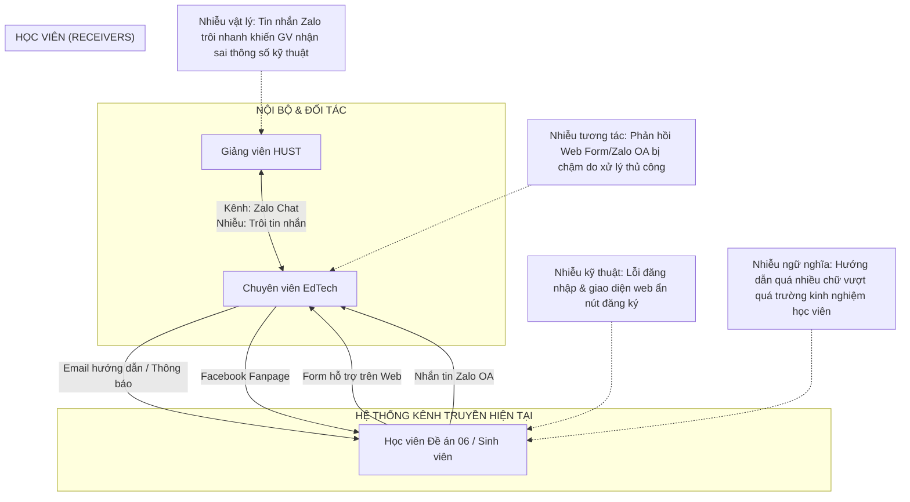

# 4. Phân tích hệ thống truyền thông hiện tại

Chương này đi sâu phân tích cấu trúc, luồng vận hành và các điểm nghẽn của hệ thống truyền thông hiện tại tại Trung tâm EdTech (daotao.ai). Bằng cách bóc tách các thành phần cấu thành hệ thống và sơ đồ hóa hệ sinh thái, báo cáo sẽ chỉ rõ những điểm đứt gãy truyền thông dưới góc nhìn lý thuyết học thuật.

## 4.1. Xác định các bên tham gia (Stakeholders)

Hệ thống truyền thông của daotao.ai chịu sự tác động tương hỗ từ ba nhóm đối tượng chính với những đặc trưng hành vi và nhu cầu thông tin khác biệt:
1.  **Ban quản trị & Chuyên viên vận hành EdTech Centre (Nguồn phát chính):** Là lực lượng chịu trách nhiệm đăng tải học liệu, xử lý kỹ thuật, giải đáp thắc mắc và báo cáo tiến độ. Chuyên viên đóng vai trò là "người gác cổng" (gatekeeper), điều phối toàn bộ các luồng thông tin ra và vào hệ thống.
2.  **Đối tác biên soạn (Giảng viên Đại học Bách khoa Hà Nội):** Chịu trách nhiệm cung cấp nội dung bài giảng, slide và ngân hàng câu hỏi thi. Nhóm này yêu cầu các chỉ dẫn kỹ thuật chính xác tuyệt đối để số hóa bài giảng đúng định dạng LMS.
3.  **Người học (Người nhận thông điệp):** Được chia thành 3 phân khúc:
    *   *Sinh viên HUST:* Nhóm trẻ, có kỹ năng công nghệ xuất sắc, tiếp thu nhanh nhưng yêu cầu phản hồi tức thì.
    *   *Học viên Đề án 06 (Cán bộ công chức):* Đối tượng trọng tâm của cải tiến. Đây là nhóm lớn tuổi, kỹ năng công nghệ còn hạn chế, dễ gặp khủng hoảng nhận thức khi thao tác trên giao diện số. Xét theo Thuyết Khuếch tán Đổi mới của Rogers (2003), đây là nhóm học viên thuộc phân khúc "nhận thức muộn" (late majority) hoặc "chậm thích ứng" (laggards), đòi hỏi các tác vụ truyền thông phải được thiết kế tối giản để thúc đẩy việc thích ứng công nghệ mới.
    *   *Học viên tự do:* Đa dạng về độ tuổi và trình độ, có tính tự chủ cao nhưng cần quy trình đăng ký đơn giản.

## 4.2. Kênh truyền thông, thông điệp và luồng truyền thông

### 4.2.1. Cấu trúc kênh giao tiếp
*   **Giao tiếp nội bộ & đối tác:** Sử dụng nhóm chat Zalo làm kênh trao đổi chính, kết hợp họp trực tiếp đối với các vấn đề triển khai lớn.
*   **Giao tiếp với người học:** Triển khai qua 3 kênh tiếp nhận thụ động: Facebook Fanpage (tiếp cận chung), Zalo OA (nhắn tin trực tiếp), và Form hỗ trợ tích hợp trên website daotao.ai.

### 4.2.2. Phân loại các nhóm thông điệp
*   **Thông điệp chỉ thị (Instruction):** Hướng dẫn học viên đăng ký, kích hoạt tài khoản và nộp bài thi.
*   **Thông điệp phối hợp (Coordination):** Chuyên viên EdTech gửi giảng viên các yêu cầu kỹ thuật biên soạn học liệu (định dạng SCORM, độ phân giải video, cấu trúc quiz).
*   **Thông điệp báo cáo (Reporting):** Báo cáo tiến độ học tập gửi Ban giám đốc và các cơ quan cử cán bộ đi học.
*   **Thông điệp hỗ trợ (Support):** Giải đáp thắc mắc về lỗi đăng nhập, lỗi hệ thống, vị trí chức năng trên web.

## 4.3. Sơ đồ Hệ sinh thái Truyền thông hiện tại

Sơ đồ dưới đây trực quan hóa luồng truyền đạt thông tin hiện tại và chỉ ra các điểm nhiễu (Noise) đang cản trở hiệu suất hệ thống:

## 4.4. Phân tích các điểm nhiễu (Noise) và bất cập thực tế

### 4.4.1. Nhiễu vật lý gây sai lệch thông số kỹ thuật (Giao tiếp nội bộ)
Việc sử dụng nhóm chat Zalo làm kênh truyền thông phối hợp kỹ thuật chính phát sinh hiện tượng quá tải thông tin. Các thông điệp chỉ số kỹ thuật phức tạp (như "độ phân giải video 1080p, định dạng nén H.264, SCORM 2004") dễ dàng bị trôi và biến dạng giữa hàng trăm tin nhắn thảo luận hàng ngày. Theo mô hình Shannon–Weaver, đây là loại **nhiễu vật lý** tác động trực tiếp vào kênh truyền, khiến giảng viên (người nhận) giải mã sai thông số, dẫn đến việc thiết kế học liệu bị lỗi khi tải lên LMS, buộc phải làm đi làm lại nhiều lần.

### 4.4.2. Đứt gãy vòng phản hồi do quá tải hỗ trợ thủ công (Giao tiếp hỗ trợ)
Khi số lượng học viên tăng vọt (đặc biệt trong các đợt bồi dưỡng Đề án 06 với hàng ngàn học viên truy cập cùng lúc), hệ thống hỗ trợ qua Form web và Zalo OA lập tức rơi vào trạng thái quá tải. Do chuyên viên EdTech phải xử lý thủ công từng yêu cầu, thời gian phản hồi trung bình bị kéo dài từ 3 đến 5 giờ. Dưới góc nhìn của mô hình giao dịch, sự chậm trễ này đã **phá vỡ vòng phản hồi (Feedback loop)**. Học viên không nhận được tương tác tức thì khi gặp lỗi kỹ thuật, dẫn đến tâm lý hoang mang, mất kiên nhẫn và tỷ lệ bỏ học giữa chừng tăng cao.

### 4.4.3. Sự lệch pha về Trường kinh nghiệm công nghệ
Đối tượng học viên lớn tuổi thuộc Đề án 06 có **Trường kinh nghiệm công nghệ (Field of Experience)** rất hẹp. Họ gặp khó khăn lớn trong việc tự xử lý lỗi đăng nhập hoặc tìm kiếm nút đăng ký khóa học. Các tài liệu hướng dẫn hiện tại do chuyên viên EdTech soạn thảo đang bị "lệch pha" vì chứa nhiều thuật ngữ kỹ thuật phức tạp (như "xóa bộ nhớ đệm cache", "chuyển chế độ trình duyệt"). Học viên không thể giải mã được thông điệp, khiến các tài liệu hướng dẫn trở nên vô hiệu.

### 4.4.4. Tải nhận thức ngoại lai quá lớn từ thiết kế giao diện và thông điệp
Giao diện hiện tại của daotao.ai chưa tối ưu, nút đăng ký khóa học được đặt ở vị trí khuất, đòi hỏi học viên phải cuộn trang nhiều lần. Bên cạnh đó, email hướng dẫn kích hoạt tài khoản có mật độ chữ quá dày đặc và thiếu điểm nhấn thị giác. Theo thuyết Tải nhận thức, các yếu tố này áp đặt một lượng **tải nhận thức ngoại lai (Extraneous Cognitive Load)** cực lớn lên học viên lớn tuổi. Bộ nhớ làm việc của họ bị cạn kiệt chỉ để tìm hiểu "làm thế nào để đăng nhập" và "nút học ở đâu", không còn dung lượng nhận thức cho việc tiếp thu nội dung bài học thực tế.
