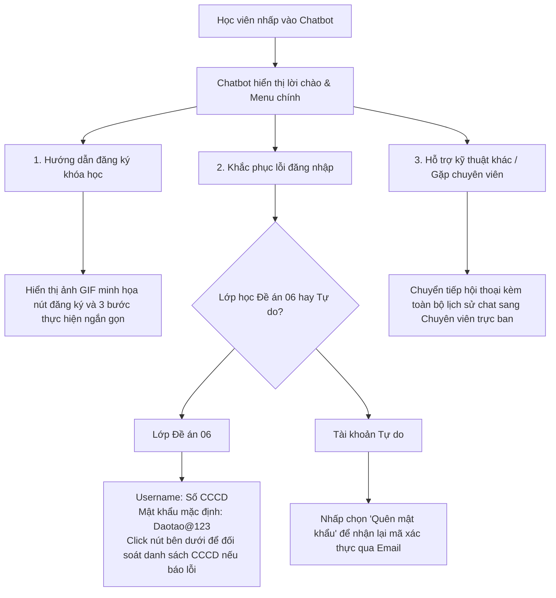

# 5. Đề xuất Thiết kế lại hệ thống truyền thông

Để giải quyết các điểm đứt gãy và rào cản truyền thông đã phân tích ở Phần 4, chương này đề xuất một giải pháp thiết kế lại hệ thống truyền thông tích hợp tại Trung tâm EdTech (daotao.ai). Trọng tâm cải tiến hướng tới việc tối ưu hóa hiệu suất truyền tin nội bộ và chuyển dịch các kênh giao tiếp với học viên theo mô hình tương tác lấy người học làm trung tâm.

## 5.1. Bản thiết kế chiến lược truyền thông tích hợp mới

Chiến lược truyền thông mới thực hiện phân tách rõ ràng vai trò của từng kênh truyền thông theo Thuyết Phong phú Truyền thông (Media Richness):
*   **Website daotao.ai:** Được định vị là kênh truyền tải chính có độ phong phú cao (Rich Media) nhờ tích hợp **Chatbot AI tự động** và tối ưu hóa giao diện (đưa nút đăng ký ra màn hình chủ, bổ sung hướng dẫn thao tác nhanh).
*   **Hệ thống Email tự động:** Đóng vai trò là kênh chỉ thị (Instructional Media) được tinh giản tối đa cấu trúc thông tin để giảm tải nhận thức ngoại lai cho học viên lớn tuổi.
*   **Zalo OA và Facebook Fanpage:** Chuyển đổi công năng từ tiếp nhận đại trà sang kênh hỗ trợ chuyên sâu (giải quyết các ca phức tạp không thể tự động hóa, đòi hỏi sự can thiệp trực tiếp của chuyên viên).

## 5.2. Sản phẩm cải tiến 1: Chatbot AI Trợ lý học tập tích hợp trên Website

Nhằm tối ưu hóa vòng phản hồi (Feedback loop) và giảm tải 80% công việc hỗ trợ thủ công, một hệ thống Chatbot AI tương tác được phát triển dựa trên dữ liệu chat lịch sử và tích hợp trực tiếp ở góc phải giao diện website daotao.ai.

### 5.2.1. Cấu trúc kịch bản phân nhánh (Decision Tree) của Chatbot

Chatbot được lập trình phân luồng xử lý thông tin dựa trên các nhóm câu hỏi lặp lại phổ biến nhất của học viên:

### 5.2.2. Kịch bản hội thoại mẫu (Dialogue Script)
*   **Học viên:** "Tôi không biết cách đăng nhập để vào học."
*   **Chatbot AI (Phản hồi sau 1 giây):**
    > *"Xin chào Anh/Chị! Để đăng nhập nhanh nhất vào lớp học Chuyển đổi số (Đề án 06), vui lòng áp dụng thông tin sau:*
    > *   * **Tên đăng nhập (Username):** Nhập chính xác số CCCD của Anh/Chị.*
    > *   * **Mật khẩu mặc định:** `Daotao@123` (Lưu ý chữ D viết hoa).*
    >
    > *Nếu hệ thống báo lỗi **'Tài khoản không tồn tại'**, rất có thể số CCCD trong danh sách đăng ký ban đầu của đơn vị bị sai lệch. Anh/Chị vui lòng nhấp vào nút **[Yêu cầu đối soát CCCD]** bên dưới để chuyên viên EdTech kiểm tra và sửa đổi ngay lập tức cho Anh/Chị."*

## 5.3. Sản phẩm cải tiến 2: Bộ Template Email hướng dẫn trực quan (Áp dụng CLT)

Thiết kế lại toàn bộ hệ thống email thông báo để giảm thiểu Tải nhận thức ngoại lai (Extraneous Cognitive Load). Email mới loại bỏ hoàn toàn các văn bản kỹ thuật dài dòng, thay thế bằng định dạng tối giản, cấu trúc phân cấp thông tin rõ ràng và có các chỉ dẫn thị giác (Visual cues).

*   **Tiêu đề Email (Subject Line):** `[daotao.ai] Hướng dẫn kích hoạt tài khoản học tập Đề án 06 (Chỉ với 3 bước)`
*   **Khung nội dung (Email Body):**
    > **Kính gửi Anh/Chị học viên,**
    >
    > Để bắt đầu khóa học trên nền tảng **daotao.ai**, Anh/Chị vui lòng thực hiện 3 bước kích hoạt tài khoản đơn giản sau đây:
    >
    > * **BƯỚC 1: Truy cập trang học tập**
    >   * Nhấp chuột vào đường dẫn: [https://daotao.ai/login](https://daotao.ai/login)
    >
    > * **BƯỚC 2: Nhập thông tin đăng nhập**
    >   * **Tên đăng nhập (Username):** *[Điền Số CCCD của Anh/Chị]*
    >   * **Mật khẩu mặc định:** `Daotao@123` (Lưu ý chữ D viết hoa).
    >
    > * **BƯỚC 3: Đổi mật khẩu mới**
    >   * Ngay sau khi đăng nhập thành công, hệ thống sẽ yêu cầu Anh/Chị đặt mật khẩu mới dễ nhớ của riêng mình để bảo mật thông tin.
    >
    > *(Có kèm hình ảnh minh họa chụp màn hình thực tế, khoanh tròn đỏ vị trí điền thông tin đăng nhập)*
    >
    > ---
    > **Cần hỗ trợ ngay?** Anh/Chị chỉ cần sử dụng tính năng **Chatbot AI Trợ lý học tập** tích hợp sẵn ở góc dưới bên phải website **daotao.ai** để được hỗ trợ 24/7.
    >
    > **Trung tâm EdTech, Đại học Bách khoa Hà Nội**

## 5.4. Đề xuất quy trình truyền thông nội bộ chuẩn hóa

Để giải quyết triệt để vấn đề trôi tin nhắn và hiểu sai thông số kỹ thuật trên nhóm chat Zalo, Trung tâm EdTech thực hiện các cải tiến giao tiếp nội bộ:
1.  **Chuyển đổi công cụ:** Thay thế việc bàn giao yêu cầu kỹ thuật qua Zalo chat bằng việc sử dụng một bảng **Kanban Board** quản trị công việc chung (như Trello hoặc Google Sheets Tracker dùng chung được phân quyền).
2.  **Chuẩn hóa thông điệp phối hợp (Coordination Template):** Quy định Giảng viên/Chuyên viên khi bàn giao học liệu bắt buộc phải điền đầy đủ thông tin theo biểu mẫu chuẩn:
    *   *Mã khóa học / Tên bài giảng*
    *   *Yêu cầu định dạng bài giảng (SCORM 2004 / Video MP4 nén H.264)*
    *   *Độ phân giải yêu cầu (1080p)*
    *   *Người chịu trách nhiệm duyệt nội dung*
3.  **Quy trình phê duyệt (Approval workflow):** Mọi thay đổi kỹ thuật chỉ được kích hoạt khi trạng thái công việc trên bảng Kanban chuyển sang "Approved" bởi người có thẩm quyền, loại bỏ hoàn toàn các thông báo bằng lời nói hoặc tin nhắn chat tự phát.
