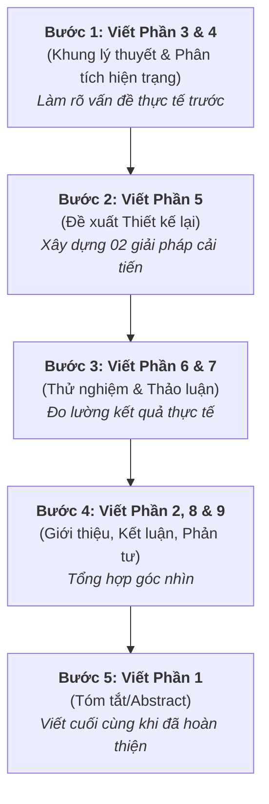

# DÀN Ý CHI TIẾT BÀI LUẬN CUỐI KỲ
**Đề tài:** Thiết kế lại hệ thống truyền thông tích hợp cho nền tảng đào tạo số daotao.ai  
**Tác giả:** Chuyên viên Trung tâm EdTech, Đại học Bách khoa Hà Nội

---

## 🧭 Chiến lược & Thứ tự viết bài (Writing Order)

Viết bài luận khoa học theo thứ tự phi tuyến tính (non-linear) sẽ giúp bài viết mạch lạc hơn và tránh việc sửa đi sửa lại nhiều lần. Dưới đây là lộ trình viết đề xuất:

---

## 📝 Nội dung chi tiết từng phần & Định hướng viết

### Phần 1. Tóm tắt (Abstract)
* **Vị trí:** Trang đầu tiên.
* **Dung lượng:** 150 – 200 từ.
* **Thứ tự viết:** **Viết cuối cùng.**
* **Nội dung cần có:**
  * Khái quát bối cảnh vận hành daotao.ai tại EdTech Centre và các sự cố hỗ trợ học viên.
  * Tuyên bố mục tiêu: Áp dụng các lý thuyết truyền thông để thiết kế lại hệ thống giao tiếp.
  * Tóm tắt giải pháp: Chatbot thông minh tự động (dựa trên dữ liệu chat lịch sử) và Bộ mẫu Email trực quan mới.
  * Tóm tắt kết quả: Cải thiện hiệu suất phản hồi và giảm tải nhận thức cho người dùng.

---

### Phần 2. Giới thiệu (Introduction)
* **Dung lượng mục tiêu:** ~300 từ.
* **Thứ tự viết:** **Viết thứ tư.**
* **Nội dung cần có:**
  * Giới thiệu EdTech Centre (HUST) và nền tảng daotao.ai (mô hình MOOC, vai trò trong Đề án 06).
  * Nêu tầm quan trọng của hệ thống truyền thông tích hợp trong đào tạo trực tuyến quy mô lớn.
  * Phát biểu vấn đề: Khoảng cách công nghệ của học viên lớn tuổi, lỗi đăng nhập/đăng ký nhiều và sự quá tải/chậm trễ trong hỗ trợ thủ công.
  * Xác định mục tiêu và phạm vi nghiên cứu của bài luận.

---

### Phần 3. Khung lý thuyết (Theoretical Framework)
* **Dung lượng mục tiêu:** ~800 từ.
* **Thứ tự viết:** **Viết đầu tiên.**
* **Nội dung cần có:**
  * **Mô hình Shannon-Weaver:** Định nghĩa nguồn, kênh, nhiễu (noise) kỹ thuật/vật lý. Trọng tâm: tính rõ ràng và giảm nhiễu.
  * **Mô hình truyền thông giao dịch/tương tác (Transactional):** Khái niệm vòng phản hồi (feedback loop) và trường kinh nghiệm (field of experience). Trọng tâm: ý nghĩa được đồng kiến tạo.
  * **Thuyết Phong phú Truyền thông (Media Richness):** Sự khác biệt giữa Rich media (video, tương tác trực tiếp) và Lean media (email text, form web) trong truyền tải thông điệp phức tạp.
  * **Thuyết Tải nhận thức (Cognitive Load Theory):** Ba loại tải (Intrinsic, Extraneous, Germane). Trọng tâm: giảm tải ngoại lai (extraneous load) thông qua tối ưu hóa truyền thông.

---

### Phần 4. Phân tích hệ thống truyền thông hiện tại
* **Dung lượng mục tiêu:** ~1.000 từ.
* **Thứ tự viết:** **Viết đầu tiên (song song với Phần 3).**
* **Nội dung cần có:**
  * **Phân tích Stakeholders:** EdTech Centre (Người gửi) $\leftrightarrow$ Học viên Đề án 06/tự do (Người nhận) $\leftrightarrow$ Giảng viên/Cơ quan cử đi học (Đối tác).
  * **Mô tả Kênh và Luồng thông điệp hiện tại:**
    * Nội bộ/Đối tác: Zalo chat, họp trực tiếp.
    * Học viên: Facebook Fanpage, Form hỗ trợ web, Zalo OA.
    * Phân loại thông điệp: Instruction, Coordination, Reporting, Support.
  * **Sơ đồ Hệ sinh thái Truyền thông:** Sơ đồ hóa luồng truyền thông hiện tại và đánh dấu các vị trí xảy ra điểm nhiễu (Noise).
  * **Phân tích các Điểm nhiễu & Điểm nghẽn:**
    * *Zalo chat:* Trôi tin nhắn nhanh $\rightarrow$ hiểu sai thông tin yêu cầu kỹ thuật (Shannon-Weaver).
    * *Đứt gãy vòng phản hồi:* Khối lượng câu hỏi lặp lại nhiều $\rightarrow$ chuyên viên quá tải $\rightarrow$ phản hồi qua form/Zalo OA bị chậm (Transactional Model).
    * *Tải nhận thức ngoại lai cao:* Học viên không thấy nút đăng ký, không biết sửa lỗi đăng nhập; kỹ năng công nghệ kém (Cognitive Load Theory).
    * *Sai lệch kênh:* Giải đáp lỗi kỹ thuật phức tạp bằng text/form nghèo nàn (Media Richness Theory).

---

### Phần 5. Đề xuất Thiết kế lại hệ thống truyền thông
* **Dung lượng mục tiêu:** ~900 từ.
* **Thứ tự viết:** **Viết thứ hai.**
* **Nội dung cần có:**
  * **Chiến lược tổng thể:** Chuyển dịch hệ thống truyền thông sang mô hình tương tác lấy người học làm trung tâm.
  * **Sản phẩm 1 - Chatbot hỗ trợ tự động (dựa trên dữ liệu chat lịch sử):**
    * Thu thập, phân loại dữ liệu hội thoại cũ để lọc ra FAQ (lỗi đăng ký, đăng nhập).
    * Quy trình hoạt động của Chatbot tích hợp trên Website daotao.ai để cung cấp phản hồi tức thì (*Instant feedback*).
  * **Sản phẩm 2 - Bộ Template Email mới trực quan:**
    * Thiết kế email theo chuẩn CLT (giảm tối đa extraneous load).
    * Hướng dẫn từng bước bằng hình ảnh (visual cues), ngôn từ đơn giản hóa thuật ngữ kỹ thuật.
  * **Đề xuất truyền thông nội bộ:** Chuẩn hóa quy trình giao tiếp kỹ thuật giữa chuyên viên EdTech và đối tác thông qua công cụ quản lý thay vì Zalo chat.

---

### Phần 6. Triển khai thử nghiệm (Implementation & Testing)
* **Dung lượng mục tiêu:** ~600 từ.
* **Thứ tự viết:** **Viết thứ ba.**
* **Nội dung cần có:**
  * Mô tả kịch bản thử nghiệm: Áp dụng chatbot tự động tích hợp trên website daotao.ai và gửi mẫu email mới cho một nhóm học viên Đề án 06 trong 1–2 tuần.
  * Đo lường kết quả định lượng:
    * Tỷ lệ chatbot tự xử lý thành công (giảm bao nhiêu % tin nhắn hỗ trợ thủ công).
    * Tốc độ phản hồi trung bình giảm từ bao nhiêu giờ xuống giây.
    * Tỷ lệ học viên tự đăng nhập/đăng ký thành công qua email hướng dẫn mới.
  * Đo lường kết quả định tính: Khảo sát nhanh ý kiến của học viên lớn tuổi về bộ hướng dẫn trực quan mới.

---

### 7. Thảo luận (Discussion)
* **Dung lượng mục tiêu:** ~300 từ.
* **Thứ tự viết:** **Viết thứ ba (song song với Phần 6).**
* **Nội dung cần có:**
  * Giải thích nguyên nhân thành công của giải pháp dựa trên lý thuyết (Chatbot tạo vòng phản hồi nhanh; Email trực quan giúp giảm tải nhận thức).
  * Đánh giá tính khả thi khi nhân rộng mô hình này cho các khóa học MOOC khác trên daotao.ai.
  * Nhận diện các vấn đề phát sinh: Một nhóm nhỏ học viên vẫn có xu hướng bỏ qua chatbot để đòi gọi điện thoại trực tiếp (nhu cầu giao tiếp trực tiếp cao).

---

### 8. Kết luận (Conclusion)
* **Dung lượng mục tiêu:** ~200 từ.
* **Thứ tự viết:** **Viết thứ tư.**
* **Nội dung cần có:**
  * Tóm tắt ngắn gọn đóng góp của đề tài trong việc giải quyết vấn đề thực tế của daotao.ai.
  * Tầm quan trọng của tư duy hệ thống trong vận hành giáo dục số.
  * Khuyến nghị phát triển tiếp theo (tích hợp AI Agent hỗ trợ sâu hơn).

---

### 9. Phản tư (Reflection)
* **Dung lượng mục tiêu:** ~300 từ.
* **Thứ tự viết:** **Viết thứ tư (song song với Kết luận).**
* **Nội dung cần có:**
  * Phản tư về vai trò của bản thân: Từ một chuyên viên hỗ trợ thụ động sang một người thiết kế hệ thống truyền thông có cơ sở khoa học.
  * Nhận thức mới về công nghệ trong giáo dục: Công nghệ không chỉ để dạy học mà còn định hình toàn bộ luồng truyền thông và trải nghiệm người học.
  * Giới hạn của nghiên cứu và bài học kinh nghiệm nghề nghiệp rút ra.

---

### 10. Tài liệu tham khảo (References)
* **Thứ tự viết:** **Thực hiện song song trong suốt quá trình viết.**
* **Yêu cầu:** Đảm bảo tất cả các nguồn lý thuyết và thực tiễn được trích dẫn đúng định dạng APA (7th edition) cả ở trong bài viết (in-text citation) và danh mục tài liệu tham khảo cuối bài.

---

### 11. Phụ lục (Appendix)
* **Nội dung cần có:**
  * Sơ đồ kịch bản của Chatbot.
  * Hình ảnh thiết kế (Mockup) bộ Template Email mới so với Email cũ.
  * Biểu đồ/bảng số liệu thống kê thời gian phản hồi trước và sau khi thử nghiệm.
