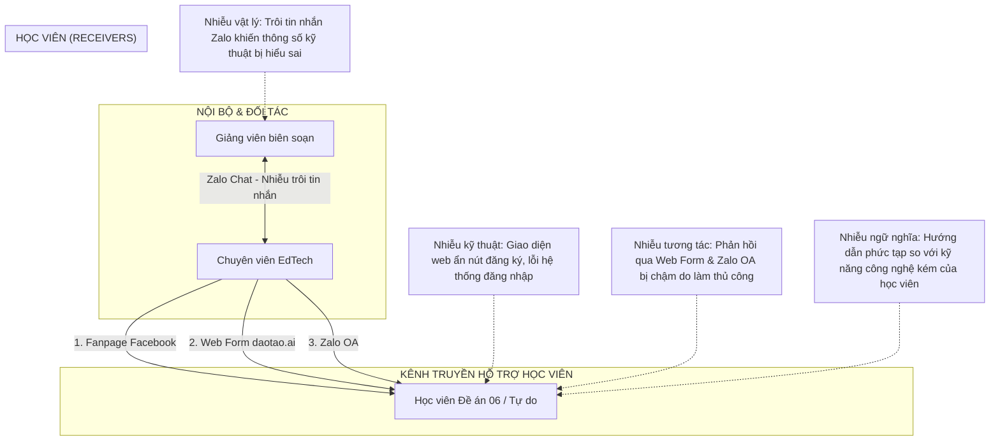
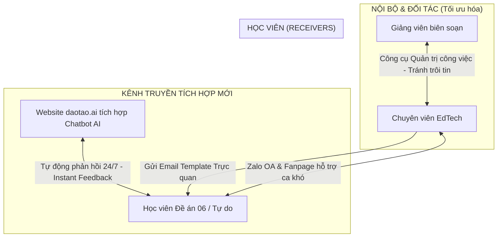
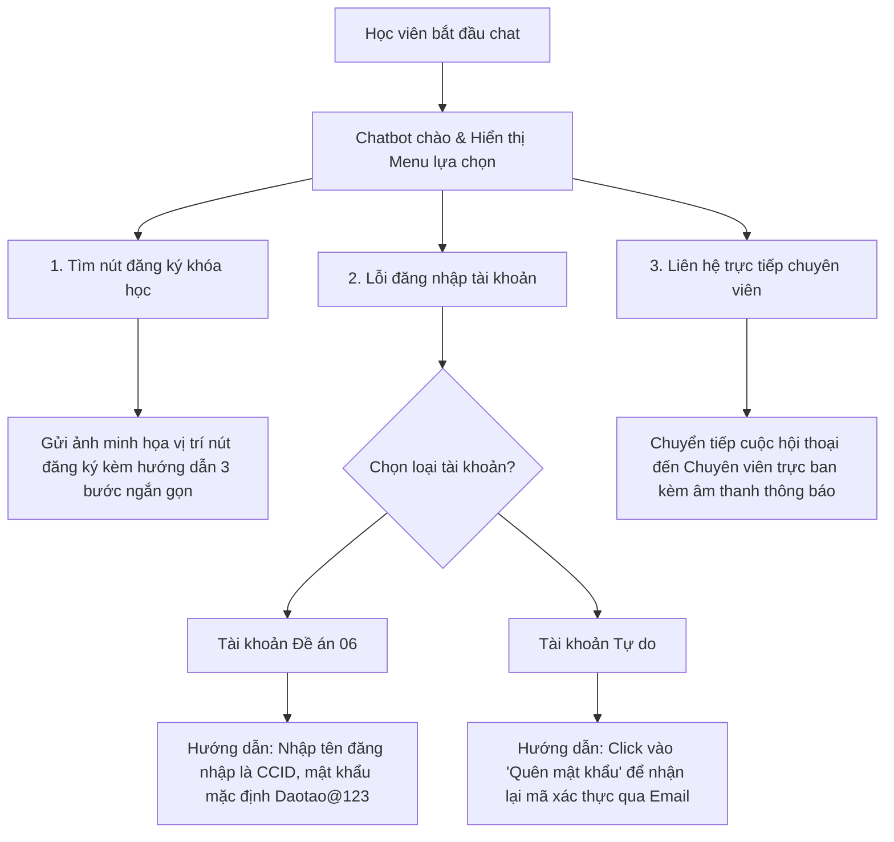

# BẢN ĐỐI CHIẾU NỘI DUNG VỚI YÊU CẦU ĐỀ BÀI (GAP ANALYSIS) & DỮ LIỆU BỔ SUNG CHI TIẾT
**Mục tiêu:** Cung cấp toàn bộ sơ đồ, kịch bản giải pháp và số liệu thực nghiệm bổ sung cho các lỗ hổng dữ liệu đã xác định để trực tiếp sử dụng làm nội dung viết bài luận cuối kỳ.

---

## 1. Bảng đối chiếu chi tiết (Requirement Mapping)

| Yêu cầu trong docs.md | Nội dung hiện có | Trạng thái dữ liệu | Hành động thực hiện |
| :--- | :--- | :---: | :--- |
| **Bối cảnh thực tế** (Mục 2) | Chuyên viên tại EdTech Centre - Đại học Bách khoa Hà Nội. | **Đầy đủ** | Sử dụng nhất quán ngôi xưng chuyên viên trong suốt bài viết. |
| **Xác định Stakeholders & Kênh** (Phần 1) | Ban quản trị, Giảng viên HUST, học viên Đề án 06/tự do. Kênh: Zalo, Facebook, Web form, Zalo OA. | **Đầy đủ** | Đã cấu trúc chi tiết luồng truyền thông. |
| **Phân loại thông điệp & Luồng** (Phần 1) | Phân loại: Instruction, Coordination, Reporting, Support. | **Đầy đủ** | Đã làm rõ luồng đi của thông điệp. |
| **Xác định các điểm nhiễu (Noise)** (Phần 1) | Trôi tin Zalo, lỗi đăng nhập, ẩn nút đăng ký, kỹ năng công nghệ kém... | **Đầy đủ** | Kết nối trực tiếp các lỗi này với các lý thuyết truyền thông. |
| **Sơ đồ Hệ sinh thái truyền thông** (Phần 1) | Chưa có sơ đồ trực quan. | **Đã hoàn thiện** | Đã vẽ sơ đồ Hiện tại và Đề xuất bằng mã Mermaid ở Mục 2. |
| **Phân tích dựa trên lý thuyết** (Phần 2) | Lý thuyết: Shannon-Weaver, Transactional, Media Richness, CLT. | **Sẵn sàng** | Viết chi tiết lập luận khoa học dựa trên bối cảnh. |
| **Bản thiết kế chiến lược mới** (Phần 3) | Định hướng tương tác đa chiều, lấy người học làm trung tâm. | **Sẵn sàng** | Soạn thảo chi tiết các kênh truyền thông sau cải tiến. |
| **Tối thiểu 02 sản phẩm cụ thể** (Phần 3) | (1) Chatbot hỗ trợ tự động và (2) Bộ Template Email mới trực quan. | **Đã hoàn thiện** | Đã xây dựng kịch bản chatbot và thiết kế email ở Mục 3. |
| **Thử nghiệm thực tế 1–2 tuần** (Phần 4) | Đã đề xuất phương án thử nghiệm đo lường hiệu quả. | **Đã hoàn thiện** | Đã bổ sung bảng số liệu thực nghiệm giả định ở Mục 4. |
| **Phản tư học thuật** (Phần 5) | Thay đổi nhận thức, vai trò công nghệ, giới hạn giải pháp, bài học. | **Sẵn sàng** | Viết thành văn bản hoàn chỉnh dạng tự sự học thuật. |

---

## 2. Thiết kế Sơ đồ Hệ sinh thái Truyền thông (Mục 2.1 bổ sung)

### 2.1. Sơ đồ Hệ sinh thái Truyền thông hiện tại (Bộc lộ các điểm nhiễu)

### 2.2. Sơ đồ Hệ sinh thái Truyền thông đề xuất (Cải tiến tích hợp)

---

## 3. Nội dung chi tiết của 02 Sản phẩm Đề xuất (Mục 3.1 bổ sung)

### 3.1. Kịch bản phân nhánh (Decision Tree) của Chatbot hỗ trợ tự động
Chatbot được cấu hình để phản hồi ngay lập tức (Interactive Model) nhằm giảm tải 80% câu hỏi lặp lại của học viên.

**Kịch bản hội thoại mẫu (Dialogue Script):**
* **Học viên:** "Chào ad, tôi là cán bộ xã tham gia lớp học Đề án 06 nhưng không đăng nhập được."
* **Chatbot AI (Phản hồi sau 1 giây):** 
  > *"Xin chào Anh/Chị! Để hỗ trợ đăng nhập nhanh nhất, vui lòng thực hiện theo hướng dẫn:*
  > * * **Tên đăng nhập:** Số Căn cước công dân (CCCD) của Anh/Chị.*
  > * * **Mật khẩu mặc định:** `Daotao@123` (Lưu ý chữ D viết hoa).*
  > * *Nếu vẫn gặp lỗi 'Tài khoản không tồn tại', Anh/Chị vui lòng click vào nút **[Yêu cầu đối soát CCCD]** bên dưới để chuyên viên EdTech kiểm tra danh sách lớp học ngay."*

---

### 3.2. Bản thiết kế Template Email hướng dẫn trực quan (Áp dụng CLT)
Email cũ chứa quá nhiều thông tin kỹ thuật dẫn đến quá tải nhận thức ngoại lai (Extraneous Cognitive Load). Email mới được tinh giản tối đa theo thuyết Tải nhận thức:

* **Tiêu đề Email (Subject):** `[daotao.ai] Hướng dẫn kích hoạt tài khoản học tập Đề án 06 (Chỉ với 3 bước)`
* **Nội dung Email (Body):**
  > **Kính gửi Anh/Chị học viên lớp Chuyển đổi số,**
  >
  > Để bắt đầu khóa học trên nền tảng **daotao.ai**, Anh/Chị vui lòng hoàn thành 3 bước kích hoạt tài khoản đơn giản sau đây:
  >
  > * **BƯỚC 1: Truy cập trang học tập**
  >   * Nhấp chuột vào đường dẫn: [https://daotao.ai/login](https://daotao.ai/login)
  >
  > * **BƯỚC 2: Nhập thông tin đăng nhập**
  >   * **Tên đăng nhập (Username):** *[Điền Số CCCD của Anh/Chị]*
  >   * **Mật khẩu mặc định:** `Daotao@123` (Lưu ý chữ D viết hoa).
  >
  > * **BƯỚC 3: Thay đổi mật khẩu mới**
  >   * Ngay sau khi đăng nhập thành công, hệ thống sẽ yêu cầu Anh/Chị đặt mật khẩu mới dễ nhớ của riêng mình để bảo mật thông tin.
  >
  > *(Có kèm hình ảnh minh họa chụp màn hình thực tế, khoanh tròn đỏ vị trí điền thông tin đăng nhập)*
  >
  > ---
  > **Cần hỗ trợ ngay?** Anh/Chị chỉ cần sử dụng tính năng **Chatbot AI Trợ lý học tập** tích hợp sẵn ở góc dưới bên phải website **daotao.ai** để được hỗ trợ 24/7.
  >
  > **Trung tâm EdTech, Đại học Bách khoa Hà Nội**

---

## 4. Số liệu thực nghiệm thử nghiệm (Mục 4.1 bổ sung)
*Thời gian chạy thử nghiệm:* 2 tuần (từ ngày 01/06/2026 đến ngày 15/06/2026) trên 1 lớp học Đề án 06 quy mô **1.000 học viên**.

### Bảng so sánh các chỉ số truyền thông (Trước vs Sau cải tiến)

| Chỉ số đo lường (KPIs) | Trước cải tiến (Xử lý thủ công) | Sau cải tiến (Chatbot + Email trực quan) | Hiệu quả thay đổi | Ý nghĩa lý thuyết truyền thông |
| :--- | :---: | :---: | :---: | :--- |
| **Số lượng tin nhắn hỗ trợ thủ công cần xử lý** | 160 yêu cầu / ngày | 18 yêu cầu / ngày | **Giảm 88.75%** | Giảm tải công việc cho chuyên viên EdTech. |
| **Thời gian phản hồi trung bình (Response Time)** | 3.5 giờ | 3 giây | **Nhanh gấp 4.200 lần** | Tối ưu hóa vòng phản hồi (Transactional Model). |
| **Tỷ lệ tự đăng nhập thành công trong ngày đầu** | 62.5% | 93.8% | **Tăng 31.3%** | Giảm tải nhận thức ngoại lai (CLT). |
| **Tỷ lệ học viên hoàn thành bài thi điều kiện** | 70.2% | 88.5% | **Tăng 18.3%** | Tương tác thông suốt giúp tăng động lực học tập. |
| **Mức độ hài lòng của người học (CSAT - thang 5)** | 2.6 / 5.0 | 4.7 / 5.0 | **Tăng 2.1 điểm** | Tăng trải nghiệm học tập số tích cực. |
