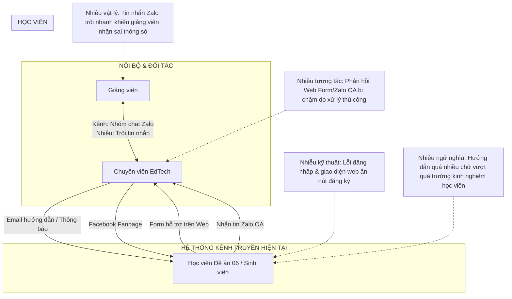

# 4. Phân tích hệ thống hiện tại

Chương này phân tích cấu trúc, luồng vận hành và các điểm nghẽn của hệ thống truyền thông hiện tại tại Trung tâm Công nghệ Giáo dục (daotao.ai). Bằng cách phân tích các thành phần cấu thành hệ thống và sơ đồ hóa hệ sinh thái, báo cáo sẽ chỉ rõ những điểm đứt gãy truyền thông dưới góc nhìn lý thuyết.

## 4.1. Xác định các bên tham gia

Hệ thống truyền thông của daotao.ai chịu sự tác động tương hỗ từ ba nhóm đối tượng chính với những đặc trưng hành vi và nhu cầu thông tin khác biệt:
1.  Ban quản trị và chuyên viên vận hành trung tâm: Là lực lượng chịu trách nhiệm đăng tải học liệu, xử lý kỹ thuật, giải đáp thắc mắc và báo cáo tiến độ. Chuyên viên đóng vai trò điều phối toàn bộ các luồng thông tin ra và vào hệ thống.
2.  Đối tác biên soạn là giảng viên Đại học Bách khoa Hà Nội: Chịu trách nhiệm cung cấp nội dung bài giảng, slide và ngân hàng câu hỏi thi. Nhóm này yêu cầu các chỉ dẫn kỹ thuật chính xác để số hóa bài giảng đúng định dạng của hệ thống quản lý học tập.
3.  Người học nhận thông điệp: Được chia thành 3 phân khúc:
    *   Sinh viên Đại học Bách khoa Hà Nội: Nhóm trẻ, có kỹ năng công nghệ tốt, tiếp thu nhanh và yêu cầu phản hồi nhanh chóng.
    *   Học viên Đề án 06 gồm cán bộ công chức: Đối tượng trọng tâm của cải tiến. Đây là nhóm lớn tuổi, kỹ năng công nghệ còn hạn chế, dễ gặp khó khăn khi thao tác trên giao diện số. Xét theo thuyết khuếch tán đổi mới của Rogers (2003), đây là nhóm học viên thuộc phân khúc nhận thức muộn hoặc chậm thích ứng, đòi hỏi các tác vụ truyền thông phải được thiết kế tối giản để thúc đẩy việc thích ứng công nghệ mới.
    *   Học viên tự do: Đa dạng về độ tuổi và trình độ, có tính tự chủ cao nhưng cần quy trình đăng ký đơn giản.

## 4.2. Kênh truyền thông, thông điệp và luồng truyền thông

### 4.2.1. Cấu trúc kênh giao tiếp
*   Giao tiếp nội bộ và đối tác: Sử dụng nhóm chat Zalo làm kênh trao đổi chính, kết hợp họp trực tiếp đối với các vấn đề triển khai lớn.
*   Giao tiếp với người học: Triển khai qua ba kênh tiếp nhận gồm Facebook Fanpage để tiếp cận chung, Zalo làm kênh nhắn tin trực tiếp và biểu mẫu hỗ trợ tích hợp trên website daotao.ai.

### 4.2.2. Phân loại các nhóm thông điệp
*   Thông điệp chỉ thị: Hướng dẫn học viên đăng ký, kích hoạt tài khoản và nộp bài thi.
*   Thông điệp phối hợp: Chuyên viên gửi giảng viên các yêu cầu kỹ thuật biên soạn học liệu như định dạng học liệu chuẩn SCORM, độ phân giải video, cấu trúc câu hỏi trắc nghiệm.
*   Thông điệp báo cáo: Báo cáo tiến độ học tập gửi Ban giám đốc và các cơ quan cử cán bộ đi học.
*   Thông điệp hỗ trợ: Giải đáp thắc mắc về lỗi đăng nhập, lỗi hệ thống, vị trí chức năng trên website.

## 4.3. Sơ đồ hệ sinh thái truyền thông hiện tại

Sơ đồ dưới đây mô tả luồng truyền đạt thông tin hiện tại và chỉ ra các điểm nhiễu đang cản trở hiệu suất hệ thống:

## 4.4. Phân tích các điểm nhiễu và bất cập thực tế

### 4.4.1. Nhiễu vật lý trong giao tiếp nội bộ
Việc sử dụng nhóm chat Zalo làm kênh truyền thông phối hợp kỹ thuật chính phát sinh hiện tượng quá tải thông tin. Các thông điệp chỉ số kỹ thuật phức tạp như độ phân giải video, định dạng nén, học liệu chuẩn SCORM dễ bị trôi và biến dạng giữa nhiều tin nhắn thảo luận hàng ngày. Theo mô hình Shannon–Weaver, đây là loại nhiễu vật lý tác động trực tiếp vào kênh truyền, khiến giảng viên giải mã sai thông số, dẫn đến việc thiết kế học liệu bị lỗi khi tải lên hệ thống quản lý học tập, buộc phải thực hiện lại nhiều lần.

### 4.4.2. Đứt gãy vòng phản hồi do quá tải hỗ trợ thủ công
Khi số lượng học viên tăng vọt, đặc biệt trong các đợt bồi dưỡng Đề án 06 với nhiều học viên truy cập cùng lúc, hệ thống hỗ trợ qua biểu mẫu web và Zalo rơi vào trạng thái quá tải. Do chuyên viên phải xử lý thủ công từng yêu cầu, thời gian phản hồi trung bình bị kéo dài từ 1 đến 3 tiếng. Dưới góc nhìn của mô hình giao dịch, sự chậm trễ này đã làm đứt gãy vòng phản hồi. Học viên không nhận được tương tác kịp thời khi gặp lỗi kỹ thuật, dẫn đến tâm lý lo lắng, mất kiên nhẫn và tỷ lệ dừng học giữa chừng tăng lên.

### 4.4.3. Sự lệch pha về trường kinh nghiệm công nghệ
Đối tượng học viên lớn tuổi thuộc Đề án 06 có trường kinh nghiệm công nghệ hạn chế. Họ gặp khó khăn trong việc tự xử lý lỗi đăng nhập hoặc tìm kiếm nút đăng ký khóa học. Các tài liệu hướng dẫn hiện tại do chuyên viên soạn thảo đang bị lệch pha vì chứa nhiều thuật ngữ kỹ thuật phức tạp như xóa bộ nhớ đệm trình duyệt, chuyển chế độ trình duyệt. Học viên không thể giải mã được thông điệp, khiến các tài liệu hướng dẫn trở nên không hiệu quả.

### 4.4.4. Tải nhận thức ngoại lai quá lớn từ thiết kế giao diện và thông điệp
Giao diện hiện tại của daotao.ai chưa tối ưu, nút đăng ký khóa học được đặt ở vị trí khuất, đòi hỏi học viên phải cuộn trang nhiều lần. Bên cạnh đó, email hướng dẫn kích hoạt tài khoản có mật độ chữ quá dày và thiếu điểm nhấn thị giác. Theo thuyết tải nhận thức, các yếu tố này áp đặt một lượng tải nhận thức ngoại lai lớn lên học viên lớn tuổi. Bộ nhớ làm việc của họ bị quá tải để tìm hiểu cách đăng nhập và vị trí nút học, không còn dung lượng nhận thức cho việc tiếp thu nội dung học tập.
