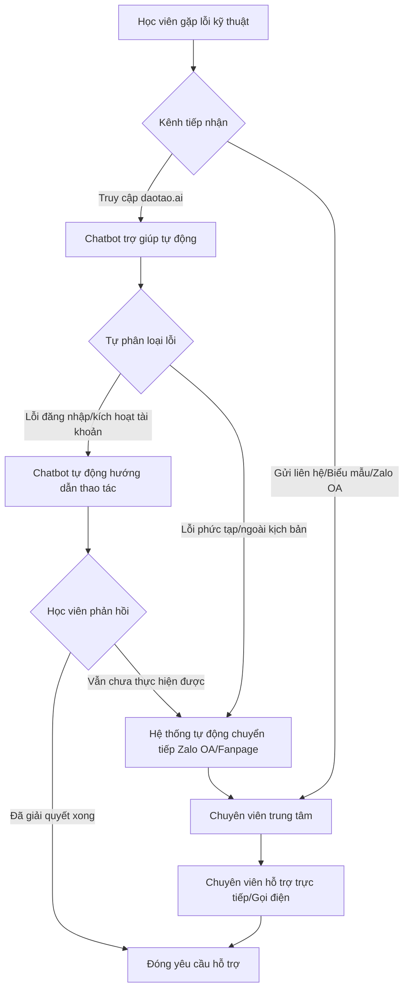

# 11. Phụ lục

## Phụ lục A. Sơ đồ hệ sinh thái truyền thông đề xuất tại daotao.ai

Dưới đây là sơ đồ chi tiết biểu diễn luồng truyền thông hỗ trợ học viên đa kênh sau cải tiến, minh họa cho mô hình hỗ trợ lai kết hợp chatbot tự động và chuyên viên hỗ trợ trực tiếp:



---

## Phụ lục B. Kịch bản hội thoại phân nhánh chi tiết của chatbot trên website

Mô tả luồng kịch bản hội thoại của chatbot khi tiếp cận học viên gặp sự cố đăng nhập trên daotao.ai:

```text
[Hệ thống]: Chào mừng bạn đến với daotao.ai! Tôi là Trợ lý ảo hỗ trợ học tập. Tôi có thể giúp gì cho bạn?
    ├── [Lựa chọn 1: Tôi không đăng nhập được tài khoản]
    │     └── [Hệ thống]: Bạn đang đăng nhập bằng phương thức nào?
    │               ├── [Lựa chọn 1.1: Đăng nhập bằng tài khoản email trường Bách khoa]
    │               │     └── [Hệ thống]: Đối với sinh viên và giảng viên, vui lòng sử dụng tài khoản email trường và chọn đăng nhập qua cổng đăng nhập tập trung.
    │               │           └── [Hệ thống]: Bạn đã đăng nhập được chưa? (Có / Chưa)
    │               └── [Lựa chọn 1.2: Đăng nhập bằng tài khoản Đề án 06]
    │                     └── [Hệ thống]: Vui lòng kiểm tra thư điện tử kích hoạt từ trung tâm. Bạn có nhận được mã kích hoạt tài khoản không?
    │                               ├── [Có, tôi có mã]: Nhập mã vào ô kích hoạt tại trang đăng nhập. Hướng dẫn chi tiết: [Xem tại đây]
    │                               └── [Không, tôi không nhận được]: Hãy cung cấp địa chỉ thư điện tử hoặc số điện thoại để tôi kiểm tra trạng thái trên hệ thống quản lý học tập.
    └── [Lựa chọn 2: Tôi muốn đăng ký khóa học mới]
          └── [Hệ thống]: Bạn hãy di chuột lên góc phải màn hình, bấm vào nút màu cam "ĐĂNG KÝ NGAY". Hướng dẫn từng bước bằng hình ảnh tại đây: [Xem tại đây]
```

---

## Phụ lục C. Bản phác thảo cấu trúc email hướng dẫn kích hoạt tài khoản tối giản

Bản phác thảo mẫu thư điện tử mới được thiết kế nhằm tối thiểu hóa tải nhận thức ngoại lai:

```text
+-----------------------------------------------------------------------+
|  [Logo Bách khoa Hà Nội - Trung tâm Công nghệ Giáo dục]               |
+-----------------------------------------------------------------------+
|  Chào anh/chi [Tên học viên],                                         |
|  Chúc mừng anh/chị đã tham gia lớp bồi dưỡng Đề án 06.                |
|  Để bắt đầu học tập ngay, anh/chị chỉ cần hoàn thành 3 bước sau:      |
|                                                                       |
|  [BƯỚC 1: NHẬN THÔNG TIN ĐĂNG NHẬP]                                   |
|  * Tài khoản: [Địa chỉ email của học viên]                            |
|  * Mật khẩu tạm thời: [Mật khẩu ngẫu nhiên]                           |
|                                                                       |
|  [BƯỚC 2: TRUY CẬP WEBSITE]                                           |
|  * Anh/chị bấm vào nút lớn bên dưới để mở trang học:                  |
|    =========================================                          |
|    ||        NÚT: TRUY CẬP TRANG HỌC TẬP      || (Màu cam nổi bật)    |
|    =========================================                          |
|                                                                       |
|  [BƯỚC 3: ĐỔI MẬT KHẨU MỚI]                                           |
|  * Nhập mật khẩu tạm thời ở trên, sau đó hệ thống sẽ tự động hiện ra  |
|    ô nhập mật khẩu mới. Hãy nhập mật khẩu anh/chị dễ nhớ nhất.        |
|                                                                       |
|  * Lưu ý: Nếu gặp bất kỳ khó khăn nào, anh/chị chỉ cần bấm vào        |
|    biểu tượng Chatbox ở góc dưới bên phải màn hình daotao.ai để được  |
|    hỗ trợ tự động 24/7.                                               |
+-----------------------------------------------------------------------+
```

---

## Phụ lục D. Dữ liệu khảo sát mức độ hài lòng định tính trước và sau cải tiến

Phân loại các phản hồi định tính của học viên Đề án 06 lớn tuổi qua các kênh tiếp nhận phản hồi và Zalo:

| Kênh khảo sát | Nội dung phản hồi trước cải tiến (Email cũ & Hỗ trợ Zalo) | Nội dung phản hồi sau cải tiến (Email trực quan & Chatbot Website) |
| :--- | :--- | :--- |
| Email hướng dẫn | "Thư hướng dẫn quá dài, có nhiều từ chuyên ngành như LMS, SCORM làm tôi không biết phải click vào đâu." (Học viên 52 tuổi) | "Thư hướng dẫn rất rõ ràng, có 3 bước lớn chữ to nên tôi đọc và tự làm theo được ngay." (Học viên 48 tuổi) |
| Tốc độ phản hồi | "Tôi gửi yêu cầu lấy lại mật khẩu từ sáng nhưng đến chiều muộn mới nhận được câu trả lời từ chuyên viên." (Học viên 45 tuổi) | "Hỏi chatbot trên website trả lời ngay lập tức, hướng dẫn đúng chỗ tôi đang bị kẹt nên tôi tự làm được." (Học viên 50 tuổi) |
| Trải nghiệm sử dụng | "Tìm mãi không thấy nút đăng ký ở đâu trên điện thoại vì giao diện quá nhiều chữ." (Học viên 55 tuổi) | "Tôi bấm vào hỗ trợ là chatbot chỉ ngay nút đăng ký màu cam ở góc màn hình, rất dễ tìm." (Học viên 53 tuổi) |
