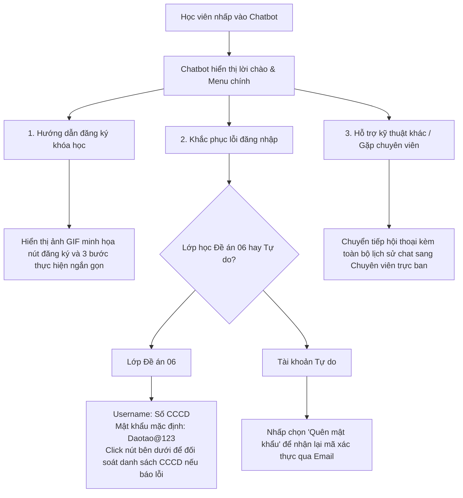

# Các sản phẩm thiết kế truyền thông cải tiến
*Học phần: Khoa học truyền thông*

Tài liệu này trình bày chi tiết nội dung, cấu trúc và quy trình của ba sản phẩm cải tiến truyền thông được đề xuất áp dụng tại Trung tâm Công nghệ Giáo dục (daotao.ai), Đại học Bách khoa Hà Nội.

---

## 1. Tích hợp chatbot tự động trên website daotao.ai

Hệ thống chatbot tương tác được đặt trực tiếp ở góc phải giao diện website daotao.ai nhằm phản hồi lập tức các lỗi kỹ thuật lặp lại phổ biến nhất của học viên.

### 1.1. Kịch bản phân nhánh của chatbot

Chatbot được lập trình phân luồng xử lý thông tin dựa trên các nhóm câu hỏi lặp lại phổ biến nhất của học viên:



### 1.2. Kịch bản hội thoại mẫu
*   Học viên: "Chào ban hỗ trợ, tôi tham gia lớp bồi dưỡng Đề án 06 của địa phương nhưng không đăng nhập được."
*   Chatbot (Phản hồi sau 1 giây):
    > "Xin chào Anh/Chị! Để hỗ trợ đăng nhập nhanh nhất vào lớp học Chuyển đổi số (Đề án 06), vui lòng thực hiện theo hướng dẫn:
    > *   Tên đăng nhập (Username): Nhập chính xác số căn cước công dân (12 chữ số) của Anh/Chị.
    > *   Mật khẩu mặc định: Daotao@123 (Lưu ý chữ D viết hoa, không có khoảng cách).
    >
    > Nếu hệ thống báo lỗi 'Tài khoản không tồn tại', rất có thể số căn cước công dân trong danh sách đăng ký ban đầu từ đơn vị của Anh/Chị bị sai lệch. Anh/Chị vui lòng bấm vào nút Yêu cầu đối soát CCCD ngay bên dưới để chuyên viên kiểm tra và sửa đổi thông tin cho Anh/Chị nhé!"

---

## 2. Mẫu email hướng dẫn trực quan

Mẫu email hướng dẫn kích hoạt tài khoản được thiết kế lại nhằm tối thiểu hóa tải nhận thức ngoại lai thông qua cấu trúc thông tin đơn giản, trực quan và có chỉ dẫn thị giác.

*   Tiêu đề Email: `[daotao.ai] Hướng dẫn kích hoạt tài khoản học tập Đề án 06 (Chỉ với 3 bước)`
*   Bản phác thảo cấu trúc giao diện Email:

```text
+-----------------------------------------------------------------------+
|  [Logo Bách khoa Hà Nội - Trung tâm Công nghệ Giáo dục]               |
+-----------------------------------------------------------------------+
|  Kính gửi Anh/Chị học viên,                                           |
|                                                                       |
|  Để bắt đầu khóa học trên nền tảng daotao.ai, Anh/Chị vui lòng thực   |
|  hiện 3 bước kích hoạt tài khoản đơn giản sau đây:                    |
|                                                                       |
|  [BƯỚC 1: TRUY CẬP WEBSITE]                                           |
|  * Anh/Chị bấm vào nút lớn màu cam bên dưới để mở trang đăng nhập:    |
|    =========================================                          |
|    ||        NÚT: TRUY CẬP TRANG HỌC TẬP      || (Màu cam nổi bật)    |
|    =========================================                          |
|                                                                       |
|  [BƯỚC 2: NHẬN THÔNG TIN ĐĂNG NHẬP]                                   |
|  * Tên đăng nhập (Username): [Điền Số căn cước công dân của học viên] |
|  * Mật khẩu mặc định: Daotao@123 (Lưu ý chữ D viết hoa)               |
|                                                                       |
|  [BƯỚC 3: THAY ĐỔI MẬT KHẨU MỚI]                                      |
|  * Ngay sau khi đăng nhập thành công, hệ thống sẽ tự động hiện bảng   |
|    yêu cầu đặt mật khẩu mới dễ nhớ của riêng Anh/Chị.                 |
|                                                                       |
|  (Đính kèm hình ảnh minh họa chụp màn hình thực tế, khoanh tròn đỏ    |
|  vị trí điền thông tin đăng nhập)                                     |
|                                                                       |
|  ---                                                                  |
|  * Cần hỗ trợ ngay? Anh/Chị chỉ cần bấm vào biểu tượng chatbot        |
|    Trợ lý học tập ở góc dưới bên phải website daotao.ai (24/7).       |
|                                                                       |
|  Trung tâm Công nghệ Giáo dục, Đại học Bách khoa Hà Nội               |
+-----------------------------------------------------------------------+
```

---

## 3. Quy trình truyền thông nội bộ

Quy trình giao tiếp nội bộ nhằm giảm thiểu hiện tượng trôi tin nhắn và hiểu sai thông số kỹ thuật bài giảng khi làm việc với giảng viên.

### 3.1. Chuyển đổi công cụ quản trị
*   Thay thế việc trao đổi yêu cầu qua nhóm chat Zalo bằng bảng quản trị công việc Kanban dùng chung, phân quyền rõ ràng theo trạng thái: Cần làm $\rightarrow$ Đang làm $\rightarrow$ Rà soát kỹ thuật $\rightarrow$ Đã duyệt.

### 3.2. Mẫu phối hợp yêu cầu kỹ thuật
Mọi yêu cầu bàn giao học liệu từ giảng viên hoặc chuyên viên phải điền đầy đủ các trường thông tin cố định sau:

| Trường thông tin | Nội dung chi tiết cần nhập |
| :--- | :--- |
| Mã & Tên khóa học | Ví dụ: Đề án 06 - Lớp Chuyển đổi số cấp xã |
| Tên bài giảng số hóa | Ví dụ: Bài 3 - Mô hình Truyền thông |
| Định dạng bàn giao | Bắt buộc chọn: Học liệu chuẩn SCORM 2004 hoặc Video MP4 nén H.264 |
| Độ phân giải video | Bắt buộc chọn: 1080p (1920x1080) |
| Người gửi yêu cầu | Tên giảng viên hoặc chuyên viên gửi |
| Người duyệt chất lượng | Tên chuyên viên kiểm soát chất lượng của trung tâm |
| Ghi chú kỹ thuật | Các lưu ý về âm thanh hoặc thời lượng |

### 3.3. Quy trình phê duyệt
1.  Bước 1 (Gửi yêu cầu): Giảng viên tải học liệu lên thư mục dùng chung và cập nhật thẻ công việc trên bảng quản trị kèm biểu mẫu phối hợp yêu cầu kỹ thuật.
2.  Bước 2 (Kiểm duyệt): Chuyên viên kiểm tra học liệu trên hệ thống chạy thử.
3.  Bước 3 (Duyệt hoặc yêu cầu sửa): 
    *   Nếu lỗi: Thẻ chuyển về cột "Cần làm" kèm ghi nhận lỗi cụ thể, không thông báo qua nhóm chat Zalo.
    *   Nếu đạt: Thẻ chuyển sang "Đã duyệt" và chuyên viên tiến hành đẩy lên website daotao.ai chính thức.
