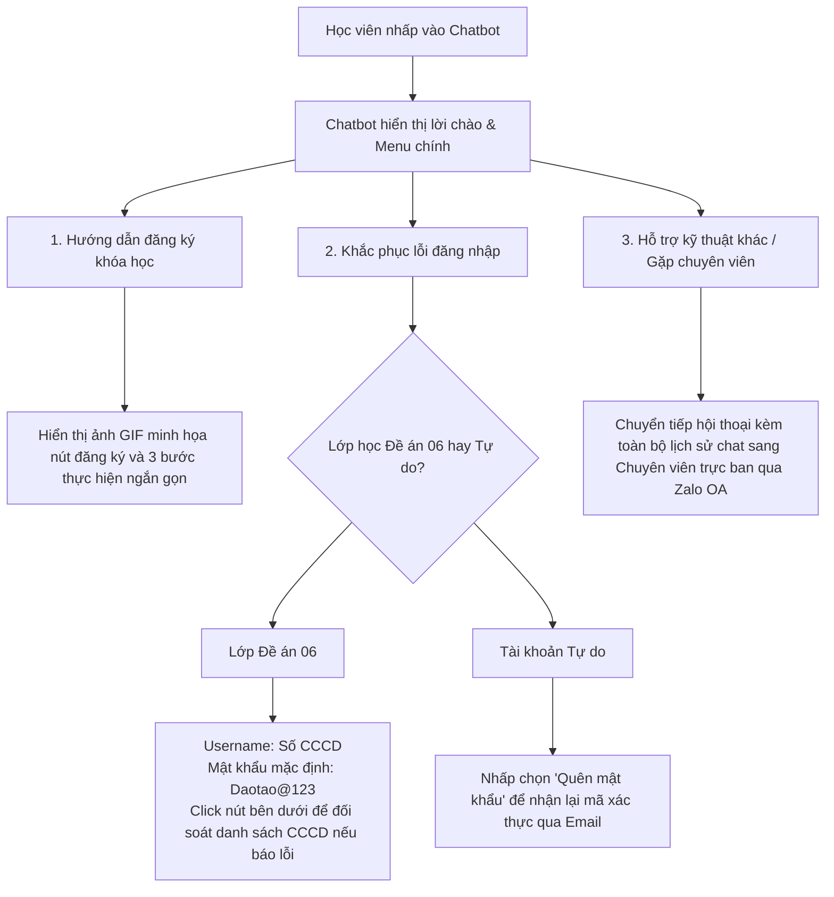

# CÁC SẢN PHẨM THIẾT KẾ TRUYỀN THÔNG CẢI TIẾN - DAOTAO.AI
*Học phần: Khoa học Truyền thông*

Tài liệu này trình bày chi tiết nội dung, cấu trúc và quy trình của 03 sản phẩm cải tiến truyền thông được đề xuất áp dụng tại Trung tâm EdTech (daotao.ai), Đại học Bách khoa Hà Nội.

---

## 1. Sản phẩm 1: Chatbot AI Trợ lý học tập tích hợp trên Website daotao.ai

Hệ thống Chatbot AI tương tác được đặt trực tiếp ở góc phải giao diện website daotao.ai nhằm phản hồi lập tức (Instant Feedback) các lỗi kỹ thuật lặp lại phổ biến nhất của học viên.

### 1.1. Sơ đồ Kịch bản Phân nhánh (Decision Tree) của Chatbot



### 1.2. Kịch bản hội thoại mẫu (Dialogue Script)
*   **Học viên:** "Chào ad, tôi tham gia lớp bồi dưỡng Đề án 06 của địa phương nhưng không đăng nhập được."
*   **Chatbot AI (Phản hồi sau 1 giây):**
    > *"Xin chào Anh/Chị! Để hỗ trợ đăng nhập nhanh nhất vào lớp học Chuyển đổi số (Đề án 06), vui lòng thực hiện theo hướng dẫn:*
    > *   * **Tên đăng nhập (Username):** Nhập chính xác số CCCD (12 chữ số) của Anh/Chị.*
    > *   * **Mật khẩu mặc định:** `Daotao@123` (Lưu ý chữ D viết hoa, không có khoảng cách).*
    >
    > *Nếu hệ thống báo lỗi **'Tài khoản không tồn tại'**, rất có thể số CCCD trong danh sách đăng ký ban đầu từ đơn vị của Anh/Chị bị sai lệch. Anh/Chị vui lòng click vào nút **[Yêu cầu đối soát CCCD]** ngay bên dưới để chuyên viên EdTech kiểm tra và sửa đổi thông tin cho Anh/Chị nhé!"*

---

## 2. Sản phẩm 2: Bộ Template Email hướng dẫn trực quan (Áp dụng CLT)

Mẫu Email hướng dẫn kích hoạt tài khoản được thiết kế lại nhằm tối thiểu hóa tải nhận thức ngoại lai (Extraneous Cognitive Load) thông qua cấu trúc thông tin đơn giản, trực quan và có chỉ dẫn thị giác (Visual cues).

*   **Tiêu đề Email (Subject Line):** `[daotao.ai] Hướng dẫn kích hoạt tài khoản học tập Đề án 06 (Chỉ với 3 bước)`
*   **Bản phác thảo cấu trúc giao diện Email (Email Body Wireframe):**

```text
+-----------------------------------------------------------------------+
|  [Logo Bách khoa Hà Nội - EdTech Centre]                              |
+-----------------------------------------------------------------------+
|  Kính gửi Anh/Chị học viên,                                           |
|                                                                       |
|  Để bắt đầu khóa học trên nền tảng daotao.ai, Anh/Chị vui lòng thực   |
|  hiện 3 bước kích hoạt tài khoản đơn giản sau đây:                    |
|                                                                       |
|  [BƯỚC 1: TRUY CẬP WEBSITE]                                           |
|  * Anh/Chị click vào nút lớn màu cam bên dưới để mở trang đăng nhập:  |
|    =========================================                          |
|    ||        NÚT: TRUY CẬP TRANG HỌC TẬP      || (Màu cam nổi bật)    |
|    =========================================                          |
|                                                                       |
|  [BƯỚC 2: NHẬN THÔNG TIN ĐĂNG NHẬP]                                   |
|  * Tên đăng nhập (Username): [Điền Số CCCD của học viên]              |
|  * Mật khẩu mặc định: Daotao@123 (Lưu ý chữ D viết hoa)               |
|                                                                       |
|  [BƯỚC 3: THAY ĐỔI MẬT KHẨU MỚI]                                      |
|  * Ngay sau khi đăng nhập thành công, hệ thống sẽ tự động hiện bảng   |
|    yêu cầu đặt mật khẩu mới dễ nhớ của riêng Anh/Chị.                  |
|                                                                       |
|  *(Đính kèm hình ảnh minh họa chụp màn hình thực tế, khoanh tròn đỏ  |
|  vị trí điền thông tin đăng nhập)*                                    |
|                                                                       |
|  ---                                                                  |
|  * Cần hỗ trợ ngay? Anh/Chị chỉ cần nhấp vào biểu tượng Chatbot AI    |
|    Trợ lý học tập ở góc dưới bên phải website daotao.ai (24/7).       |
|                                                                       |
|  Trung tâm EdTech, Đại học Bách khoa Hà Nội                           |
+-----------------------------------------------------------------------+
```

---

## 3. Sản phẩm 3: Quy trình Truyền thông Nội bộ và Phối hợp Đối tác chuẩn hóa

Quy trình giao tiếp nội bộ nhằm triệt tiêu hoàn toàn hiện tượng trôi tin nhắn và hiểu sai thông số kỹ thuật bài giảng khi làm việc với giảng viên (đối tác).

### 3.1. Chuyển đổi công cụ quản trị
*   Thay thế việc trao đổi yêu cầu qua Zalo chat bằng bảng **Kanban Board** (Trello/Google Sheets Tracker) dùng chung, phân quyền rõ ràng theo trạng thái: *To Do (Cần làm) $\rightarrow$ In Progress (Đang làm) $\rightarrow$ Review (Rà soát kỹ thuật) $\rightarrow$ Approved (Đã duyệt tải lên LMS)*.

### 3.2. Mẫu Phối hợp Yêu cầu Kỹ thuật (Coordination Template)
Mọi yêu cầu bàn giao học liệu từ giảng viên hoặc chuyên viên phải điền đầy đủ các trường thông tin cố định sau:

| Trường thông tin | Nội dung chi tiết cần nhập |
| :--- | :--- |
| **Mã & Tên khóa học** | Ví dụ: Đề án 06 - Lớp Chuyển đổi số cấp xã |
| **Tên bài giảng số hóa** | Ví dụ: Bài 3 - Mô hình Truyền thông |
| **Định dạng bàn giao** | Bắt buộc chọn: SCORM 2004 / Video MP4 (Chuẩn nén H.264) |
| **Độ phân giải video** | Bắt buộc chọn: 1080p (1920x1080) |
| **Người gửi yêu cầu** | Tên giảng viên / Chuyên viên gửi |
| **Người duyệt chất lượng** | Tên chuyên viên kiểm soát chất lượng EdTech |
| **Ghi chú kỹ thuật** | Các lưu ý đặc biệt về âm thanh hoặc thời lượng |

### 3.3. Quy trình phê duyệt (Approval Workflow)
1.  **Bước 1 (Gửi yêu cầu):** Giảng viên tải học liệu lên thư mục dùng chung và cập nhật thẻ công việc trên Kanban kèm biểu mẫu Coordination Template.
2.  **Bước 2 (Kiểm duyệt):** Chuyên viên EdTech kiểm tra học liệu trên hệ thống staging.
3.  **Bước 3 (Duyệt/Yêu cầu sửa):** 
    *   *Nếu lỗi:* Thẻ chuyển về cột "To Do" kèm log lỗi cụ thể, tuyệt đối không thông báo qua chat Zalo.
    *   *Nếu đạt:* Thẻ chuyển sang "Approved" và chuyên viên tiến hành đẩy lên website daotao.ai chính thức.
