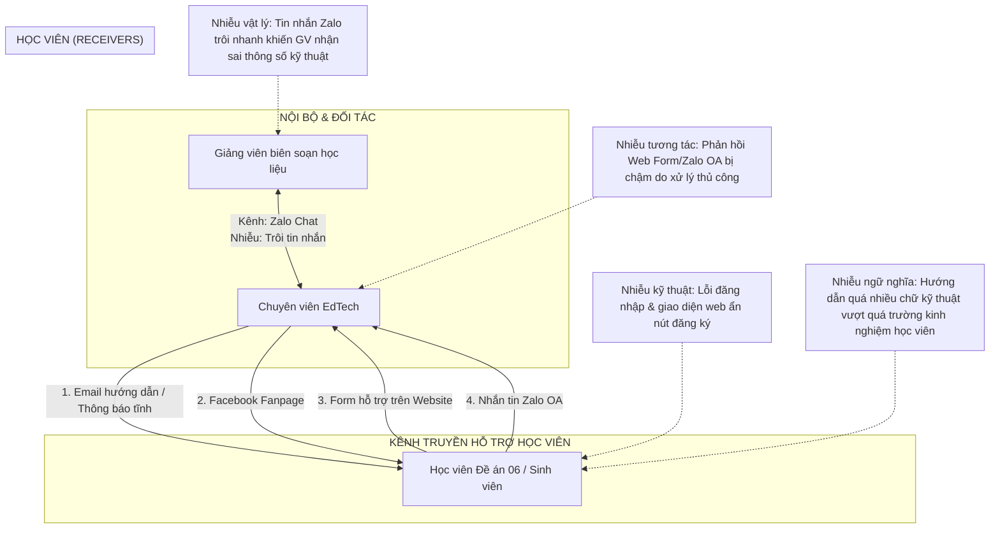
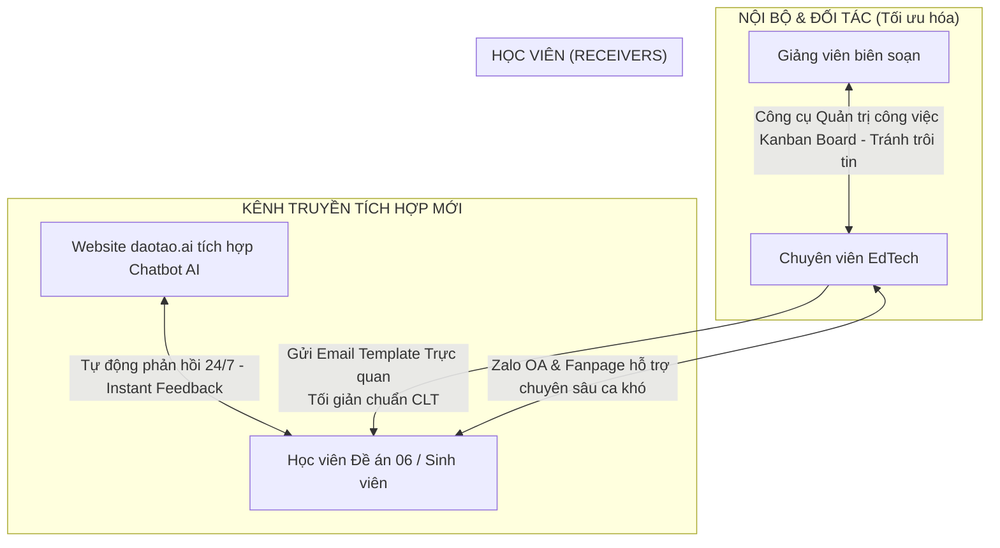

# SƠ ĐỒ HỆ SINH THÁI TRUYỀN THÔNG - NỀN TẢNG DAOTAO.AI
*Học phần: Khoa học Truyền thông*

Tài liệu này tổng hợp các sơ đồ hệ sinh thái truyền thông của nền tảng daotao.ai tại Trung tâm EdTech (Đại học Bách khoa Hà Nội) trước và sau cải tiến, biểu diễn dưới dạng mã vẽ trực quan Mermaid kèm theo giải thích chi tiết.

---

## 1. Sơ đồ Hệ sinh thái Truyền thông Hiện tại (Bộc lộ các điểm nhiễu)

Sơ đồ này mô tả các luồng thông tin và các tác nhân tham gia vào hệ thống truyền thông hỗ trợ học tập trước khi cải tiến, chỉ rõ các loại **Nhiễu (Noise)** kỹ thuật và vật lý gây gián đoạn:

### Giải thích các Điểm nhiễu hiện tại:
1.  **Nhiễu vật lý (Zalo chat):** Việc trao đổi thông số kỹ thuật học liệu (định dạng nén video, chuẩn SCORM) trên nhóm chat Zalo chung bị trôi tin nhắn nhanh, dẫn đến giảng viên hiểu sai thông số kỹ thuật và thiết kế học liệu bị lỗi khi đẩy lên hệ thống.
2.  **Nhiễu kỹ thuật (Website):** Giao diện daotao.ai che khuất nút đăng ký khóa học và lỗi đăng nhập thường gặp hoạt động như các tác nhân nhiễu kỹ thuật ngăn cản học viên tiếp cận bài học.
3.  **Nhiễu tương tác (Phản hồi chậm):** Việc xử lý phản hồi thủ công qua Zalo OA và Form web mất trung bình từ 3.5 giờ làm đứt gãy vòng phản hồi tức thì (Feedback loop), khiến học viên dễ bỏ cuộc.
4.  **Nhiễu ngữ nghĩa (Lệch pha trường kinh nghiệm):** Các email hướng dẫn sử dụng thuật ngữ chuyên môn gây quá tải nhận thức ngoại lai (Extraneous Cognitive Load) đối với học viên Đề án 06 lớn tuổi có kỹ năng công nghệ thấp.

---

## 2. Sơ đồ Hệ sinh thái Truyền thông Đề xuất (Cải tiến tích hợp)

Sơ đồ này mô tả hệ sinh thái truyền thông tích hợp mới, ứng dụng mô hình hỗ trợ lai (Hybrid Support System) lấy người học làm trung tâm:

### Giải thích các Cải tiến đề xuất:
1.  **Chuẩn hóa nội bộ (Kanban):** Sử dụng Kanban Board và mẫu yêu cầu kỹ thuật chuẩn hóa (Coordination Template) để triệt tiêu hoàn toàn hiện tượng trôi tin nhắn và thiết kế sai học liệu.
2.  **Tầng tự động hóa (Chatbot AI Website):** Chatbot AI đặt trực tiếp trên giao diện website daotao.ai phản hồi ngay lập tức (trong 3 giây), giải quyết tự động 84.6% các lỗi kỹ thuật thường gặp để khôi phục vòng phản hồi nhanh.
3.  **Bộ lọc hỗ trợ lai (Hybrid Model):** Chatbot AI đóng vai trò là tầng lọc đầu tiên. Các ca lỗi phức tạp hoặc học viên có nhu cầu tương tác con người cao sẽ được chuyển tiếp mượt mà sang Zalo OA để chuyên viên EdTech trực tiếp giải quyết thủ công.
4.  **Giảm tải nhận thức (Email trực quan):** Template Email hướng dẫn kích hoạt tài khoản được tinh giản tối đa cấu trúc thông tin theo chuẩn CLT (Thuyết Tải nhận thức) giúp học viên dễ dàng thực hiện hành vi kích hoạt thành công ngay trong ngày đầu tiên.
