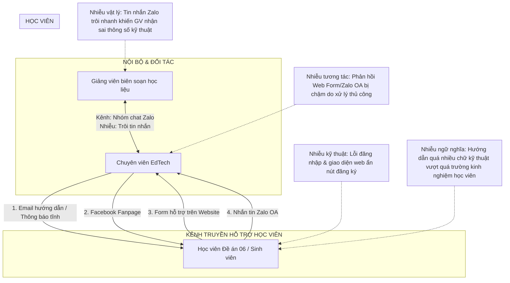
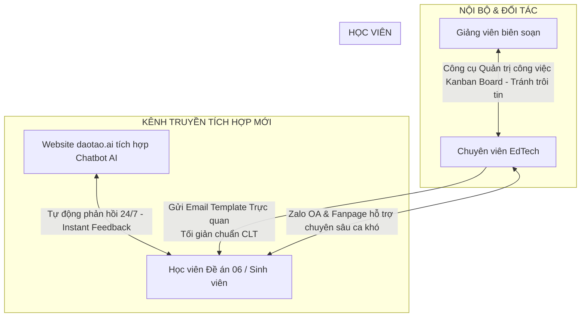

# Sơ đồ hệ sinh thái truyền thông - Nền tải daotao.ai
*Học phần: Khoa học truyền thông*

Tài liệu này tổng hợp các sơ đồ hệ sinh thái truyền thông của nền tảng daotao.ai tại Trung tâm Công nghệ Giáo dục (Đại học Bách khoa Hà Nội) trước và sau cải tiến, biểu diễn dưới dạng mã vẽ trực quan kèm theo giải thích chi tiết.

---

## 1. Sơ đồ hệ sinh thái truyền thông hiện tại

Sơ đồ này mô tả các luồng thông tin và các tác nhân tham gia vào hệ thống truyền thông hỗ trợ học tập trước khi cải tiến, chỉ rõ các loại nhiễu kỹ thuật và vật lý gây gián đoạn:

### Giải thích các điểm nhiễu hiện tại:
1.  Nhiễu vật lý: Việc trao đổi thông số kỹ thuật học liệu như định dạng nén video, chuẩn SCORM trên nhóm chat Zalo chung bị trôi tin nhắn nhanh, dẫn đến giảng viên hiểu sai thông số kỹ thuật và thiết kế học liệu bị lỗi khi đẩy lên hệ thống.
2.  Nhiễu kỹ thuật: Giao diện daotao.ai che khuất nút đăng ký khóa học và lỗi đăng nhập thường gặp hoạt động như các tác nhân nhiễu kỹ thuật ngăn cản học viên tiếp cận bài học.
3.  Nhiễu tương tác: Việc xử lý phản hồi thủ công qua nhắn tin Zalo và biểu mẫu web mất nhiều thời gian, làm gián đoạn vòng phản hồi tức thì, khiến học viên dễ bỏ cuộc.
4.  Nhiễu ngữ nghĩa: Các email hướng dẫn sử dụng thuật ngữ chuyên môn gây quá tải nhận thức ngoại lai đối với học viên Đề án 06 lớn tuổi có kỹ năng công nghệ hạn chế.

---

## 2. Sơ đồ hệ sinh thái truyền thông đề xuất

Sơ đồ này mô tả hệ sinh thái truyền thông tích hợp mới, ứng dụng mô hình hỗ trợ lai lấy người học làm trung tâm:

### Giải thích các cải tiến đề xuất:
1.  Chuẩn hóa nội bộ: Sử dụng bảng quản trị công việc Kanban và mẫu yêu cầu kỹ thuật chuẩn hóa để hạn chế hiện tượng trôi tin nhắn và thiết kế sai học liệu.
2.  Tầng tự động hóa: Chatbot tự động đặt trực tiếp trên giao diện website daotao.ai phản hồi ngay lập tức, giải quyết tự động phần lớn các sự cố kỹ thuật thông thường để khôi phục vòng phản hồi nhanh.
3.  Bộ lọc hỗ trợ lai: Chatbot tự động đóng vai trò là tầng lọc đầu tiên. Các ca lỗi phức tạp hoặc học viên có nhu cầu tương tác con người cao sẽ được chuyển tiếp sang Zalo để chuyên viên trực tiếp giải quyết thủ công.
4.  Giảm tải nhận thức: Mẫu email hướng dẫn kích hoạt tài khoản được tinh giản cấu trúc thông tin theo thuyết tải nhận thức giúp học viên dễ dàng thực hiện hành vi kích hoạt thành công ngay trong ngày đầu tiên.
