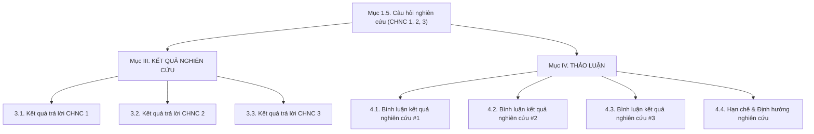

# QUY CHUẨN VIẾT BÁO CÁO HỌC THUẬT CHUẨN VIỆT NAM & LOẠI BỎ VẾT DẤU AI
*(Bộ Quy tắc & Hướng dẫn Tái sử dụng cho các Báo cáo Nghiên cứu, Tiểu luận Môn học)*

---

## I. MỤC ĐÍCH & PHẠM VI ÁP DỤNG

Tài liệu này tổng hợp toàn bộ các quy chuẩn về **Nội dung, Thuật ngữ, Hình thức Trình bày và Văn phong** nhằm giúp tạo ra các bài báo cáo khoa học, tiểu luận môn học đạt chuẩn mực học thuật tại Việt Nam, đồng thời **loại bỏ hoàn toàn các vết dấu văn mẫu và định dạng đặc trưng của AI (AI-isms)**.

Cẩm nang này được thiết kế để tái sử dụng làm tiêu chuẩn biên tập cho tất cả các báo cáo khoa học, bài thu hoạch môn học và công trình nghiên cứu tiếp theo.

---

## II. QUY TẮC NGHỆ THUẬT VIẾT VĂN & LOẠI BỎ VẾT DẤU AI

### 1. Danh sách Cụm từ Cấm (Blacklisted AI Tropes & Buzzwords)
Khi viết báo cáo, **TUYỆT ĐỐI KHÔNG SỬ DỤNG** các cụm từ chuyển ý gượng gạo và văn mẫu AI thường gặp sau:

| Các cụm từ AI cần loại bỏ | Nguyên nhân | Thay thế bằng cách diễn đạt học thuật Việt Nam |
| :--- | :--- | :--- |
| *Nhìn chung,* | Từ nối sáo rỗng, thiếu tính cụ thể. | *Tóm lại,* / *Đánh giá tổng thể cho thấy,* / *Xét trên phạm vi toàn cục,* |
| *Bên cạnh đó,* (dùng lặp lại) | Lạm dụng từ nối khiên cưỡng. | *Đồng thời,* / *Trước hết,... Song song với đó,...* / *Ở một khía cạnh khác,* |
| *Đáng chú ý là,* | Mang tính cảm thán cá nhân. | *Phân tích cho thấy,* / *Kết quả chỉ ra rằng,* / *Dữ liệu ghi nhận,* |
| *Không thể phủ nhận rằng,* | Khẳng định chủ quan, thiếu cẩn trọng. | *Các bằng chứng thực nghiệm đã khẳng định,* / *Rà soát tài liệu chỉ ra rằng,* |
| *Trong bối cảnh bùng nổ hiện nay...* | Văn mẫu mở đầu quá thông dụng. | đi thẳng vào bối cảnh cụ thể (ví dụ: *Sự ứng dụng rộng rãi của các hệ thống LMS...*) |
| *Bài viết này sẽ giúp bạn...* | Văn phong bài viết blog/website. | *Báo cáo này nhằm mục đích...* / *Nghiên cứu tập trung giải quyết...* |
| *Hãy cùng khám phá / tìm hiểu...* | Kêu gọi hành động kiểu tiếp thị. | *Nghiên cứu tiến hành rà soát...* / *Quy trình phân tích được thực hiện...* |
| *Làn gió mới / Đóng vai trò then chốt...* | Từ ngữ mỹ từ dư thừa. | *Mở ra hướng đi triển vọng...* / *Là điều kiện tiên quyết...* |

---

### 2. Thái độ Cẩn trọng Khoa học (Hedging in Academic Writing)
Đối với các báo cáo đánh giá tiền khả thi, báo cáo đề xuất hoặc thiết kế khái niệm (chưa qua kiểm chứng thực nghiệm đầy đủ), câu văn phải thể hiện thái độ cẩn trọng khoa học:
* **Không viết:** *"Mô hình này chắc chắn sẽ giải quyết triệt me khó khăn của sinh viên."*
* **Viết chuẩn khoa học:** *"Mô hình được kỳ vọng sẽ hỗ trợ sinh viên khắc phục khó khăn..."* hoặc *"Kết quả rà soát dữ liệu bước đầu cho thấy tính khả thi của hướng tiếp cận..."*

---

## III. QUY TẮC NGÔN NGỮ & XỬ LÝ THUẬT NGỮ

### 1. Quy tắc Ngôn ngữ Tiếng Việt (Quy tắc Vàng)
> [!CAUTION]
> **TUYỆT ĐỐI KHÔNG VIẾT TẮT BẤT KỲ TỪ TIẾNG VIỆT NÀO.**
> * Cấm tuyệt đối các từ viết tắt dạng: *SV, GV, ĐH, CHNC, KQNC, TN, PM, LA, SRL...*
> * Bắt buộc phải viết đầy đủ thành: *sinh viên, giảng viên, đại học, câu hỏi nghiên cứu, kết quả nghiên cứu, thực nghiệm, tự điều chỉnh học tập, phân tích học tập...*

---

### 2. Quy tắc Tiếng Anh & Thuật ngữ Chuyên ngành

#### A. Cú pháp xuất hiện lần đầu tiên:
Mọi thuật ngữ tiếng Anh khi xuất hiện lần đầu tiên trong văn bản bắt buộc phải viết theo cú pháp:
$$\text{"Từ tiếng Anh (Từ tiếng Việt)"}$$
* *Ví dụ:* `Learning Management System (Hệ thống Quản lý Học tập - LMS)`, `Event Logs (Nhật ký Sự kiện)`, `Conformance Checking (Kiểm tra độ phù hợp quy trình)`.

#### B. Quy tắc cho các lần xuất hiện tiếp theo (Từ lần thứ 2 trở đi):
* **Đối với các thuật ngữ giữ nguyên tiếng Anh (Ngoại lệ chuyên ngành):** 
  * Nếu thuật ngữ là tên ngành/tên công nghệ gốc (như *Process Mining*), lần 1 viết: `Process Mining (Khai phá Quy trình)`; từ lần 2 trở đi giữ nguyên tên tiếng Anh `Process Mining` (không dịch sang tiếng Việt và không viết tắt thành PM).
* **Đối với các thuật ngữ khác:** Sau lần xuất hiện đầu tiên, ưu tiên dùng **từ tiếng Việt tương đương** (*Phân tích Học tập*, *Nhật ký sự kiện*, *Kiểm tra độ phù hợp quy trình*, *Điểm nghẽn*...).
* **Từ viết tắt tiếng Anh:** Chỉ áp dụng cho các chuẩn công nghệ hoặc tên tập dữ liệu quốc tế quá phổ biến (như *LMS, API, CSV, XES, OULAD, Python*).

---

## IV. QUY CHUẨN HÌNH THỨC TRÌNH BÀY (LAYOUT & FORMATTING)

### 1. Triệt tiêu Lạm dụng Bullet Point dạng `* **Từ khóa:** Nội dung` (Vết dấu AI số 1)
* **Dấu hiệu AI cần tránh:**
  ```markdown
  * **Về mặt dữ liệu:** Tập dữ liệu OULAD ghi nhận...
  * **Về mặt kỹ thuật:** Thuật toán Inductive Miner...
  ```
* **Quy chuẩn học thuật Việt Nam:** Chuyển các ý này thành **các đoạn văn học thuật liên tục (continuous narrative)**, dùng các quan hệ từ từ nối tiếng Việt tự nhiên:
  > *"Xét trên phương diện dữ liệu, tập dữ liệu OULAD ghi nhận... Về mặt kỹ thuật, thuật toán Inductive Miner... Đối với khía cạnh tổ chức, mô hình đòi hỏi..."*

---

### 2. Quy chuẩn Đường kẻ ngang (`---`)
* **Dấu hiệu AI cần tránh:** Chèn các đường kẻ ngang `---` phân tách giữa các Mục I, II, III, IV, V (kiểu bài viết Markdown Blog).
* **Quy chuẩn học thuật Việt Nam:** **Không dùng bất kỳ đường kẻ ngang `---` nào trong thân văn bản.** Phân tách giữa các chương/mục bằng hệ thống tiêu đề in hoa, in đậm và khoảng cách dòng thích hợp.

---

### 3. Quy chuẩn Tiêu đề (Headings)
* **Không đặt dấu hai chấm `:` ở cuối tiêu đề:** (Cấm viết `#### Ma trận gợi ý lộ trình:`).
* **Đánh số phân cấp tiêu đề chuẩn khoa học:**
  * **Mục cấp 1:** `## I. ĐẶT VẤN ĐỀ` (In hoa, số La Mã hoặc số Ả Rập).
  * **Mục cấp 2:** `### 1.1. Bối cảnh nghiên cứu` (In đậm, số Ả Rập).
  * **Mục cấp 3:** `#### 3.3.1. Ma trận Động cơ Gợi ý Lộ trình` (In đậm, đánh số phân cấp).

---

### 4. Quy chuẩn Bảng biểu (Table Captions)
Tất cả các bảng trong báo cáo bắt buộc phải có **Tên Bảng chính thức đặt PHÍA TRÊN bảng**, định dạng in đậm:
* **Ví dụ:**
  **Bảng 1. Khung bộ chỉ số Tiến bộ Quy trình (PPM)**

  | Chiều đánh giá | Chỉ số thành phần | Ý nghĩa và Công thức đo lường |
  | :--- | :---: | :--- |
  | ... | ... | ... |

---

### 5. Cấu trúc Phân đoạn văn bản (Paragraph Structure)
* Không gom một tiểu mục lớn thành một khối đoạn văn quá dài (Monolithic paragraph).
* Mỗi tiểu mục nên gồm **2 đến 3 đoạn văn ngắn**, đoạn thứ nhất nêu luận điểm/câu chủ đề, đoạn thứ hai và ba phát triển các luận cứ và bằng chứng hỗ trợ.

---

## V. MA TRẬN ÁNH XẠ CẤU TRÚC BÁO CÁO (STRUCTURAL ALIGNMENT)

Để đảm bảo tính logic và chặt chẽ của một bài báo cáo khoa học, cấu trúc phải đảm bảo tính đối ứng 1:1 giữa các phần:



---

## VI. BẢNG CHECKLIST KIỂM TRA TRƯỚC KHI XUẤT BẢN

Trước khi hoàn tất bài báo cáo, hãy tự kiểm tra qua Bảng Checklist 8 điểm sau:

- [ ] **Check 1:** Có từ tiếng Việt nào bị viết tắt không? (Nếu có *SV, GV, ĐH, CHNC, KQNC* $\rightarrow$ Sửa ngay!).
- [ ] **Check 2:** Các từ tiếng Anh lần đầu xuất hiện có đúng dạng `"Từ tiếng Anh (Từ tiếng Việt)"` không?
- [ ] **Check 3:** Thuật ngữ `Process Mining` có được viết đúng tên tiếng Anh từ lần thứ 2 trở đi không?
- [ ] **Check 4:** Có bị lạm dụng bullet point dạng `* **Từ khóa:** ...` không? (Nếu có $\rightarrow$ Chuyển thành đoạn văn liên tục!).
- [ ] **Check 5:** Có đường kẻ ngang `---` thừa nào trong bài không? (Nếu có $\rightarrow$ Xóa ngay!).
- [ ] **Check 6:** Có tiêu đề nào kết thúc bằng dấu hai chấm `:` không? (Nếu có $\rightarrow$ Xóa dấu `:`!).
- [ ] **Check 7:** Các Bảng biểu có tên bảng phía trên chưa? (Ví dụ: *Bảng 1. ...*).
- [ ] **Check 8:** Đã loại bỏ hoàn toàn các cụm từ sáo rỗng AI (*Nhìn chung, Bên cạnh đó, Không thể phủ nhận...*) chưa?

---

*Tài liệu này được lưu giữ làm Quy chuẩn dùng chung cho tất cả các dự án báo cáo nghiên cứu và tiểu luận môn học.*
