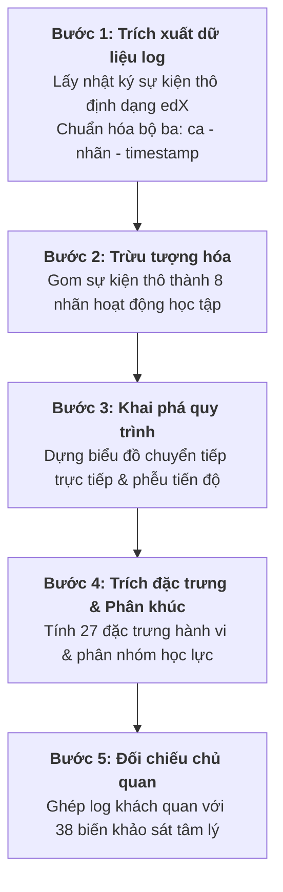

# Phần 3. PHƯƠNG PHÁP NGHIÊN CỨU THỰC NGHIỆM

## 3.1. Thiết kế thực nghiệm

Do đặc thù nghiên cứu được triển khai trên lớp học có sẵn tại môi trường đại học thực tế (khóa học trực tuyến SoDiTEC, mã lớp TDC01), nghiên cứu áp dụng **Thiết kế bán thực nghiệm nhóm không tương đương, đo lường tiền kiểm - hậu kiểm (NEGD)**.

Ký hiệu thiết kế nghiên cứu:
$$\begin{array}{cccc}
\text{Nhóm gần Thực nghiệm (Cụm A):} & O_1 & X & O_2 \\
\hline
\text{Nhóm gần Đối chứng (Cụm C):} & O_1 &   & O_2
\end{array}$$

Trong đó:
*   $O_1$: Đo lường tiền kiểm (PRE) trước khóa học.
*   $O_2$: Đo lường hậu kiểm (POST) sau khóa học.
*   $X$: Can thiệp lộ trình cá nhân hóa (dành cho nhóm thực nghiệm A).
*   Đường gạch ngang phân cách thể hiện các nhóm được gán tự nhiên, không ngẫu nhiên hóa.

**Lý do không phân bổ ngẫu nhiên:** Nghiên cứu sử dụng dữ liệu hồi cứu từ khóa học đã diễn ra nhằm bảo đảm tính tự nhiên của hành vi học tập. Các nhóm so sánh được phân cụm dựa trên chính hành vi log thực tế của học viên trong khóa học, kết hợp với các đặc điểm tâm lý tự báo cáo. Vì không thể can thiệp phân bổ ngẫu nhiên sinh viên ngay từ đầu, thiết kế NEGD là lựa chọn phù hợp. Sự lệch nền cơ sở tiềm ẩn giữa hai nhóm sẽ được kiểm soát định lượng bằng phân tích đồng biến (ANCOVA) ở phần sau.

## 3.2. Khách thể và Phương pháp chọn mẫu

### Quy trình chọn mẫu
Tổng thể nghiên cứu ban đầu gồm **1.531 học viên** đăng ký khóa học TDC01. Nghiên cứu áp dụng phương pháp **chọn mẫu có chủ đích theo tiêu chí dữ liệu đầy đủ**. Để được đưa vào mẫu phân tích sâu, học viên phải đáp ứng đồng thời hai tiêu chuẩn:
1.  Có ghi nhận log hành vi đầy đủ trên hệ thống LMS trong suốt khóa học.
2.  Hoàn thành đầy đủ bộ khảo sát ở cả ba đợt (trước khóa, trong khóa và sau khóa).

Mẫu nghiên cứu cuối cùng thu được gồm **200 học viên**, đạt tỷ lệ hoàn thành dữ liệu là $46,0\%$ (từ tổng số học viên được gửi khảo sát song song). Do đặc thù của phương pháp chọn mẫu dựa trên tính đầy đủ của dữ liệu (đồng thời cả nhật ký hệ thống và khảo sát ba đợt), nhóm học viên được chọn có thể sở hữu mức độ tương tác và tính chủ động cao hơn mặt bằng chung của tổng thể. Đặc tính này được ghi nhận như một giới hạn trong khả năng khái quát hóa kết quả đối với các nhóm đối tượng thụ động hơn.

### Cơ cấu mẫu nghiên cứu
Mẫu 200 học viên được phân bố trên 6 đợt tuyển sinh/lớp học khác nhau và được gộp vào 3 cụm lộ trình hình thành tự nhiên: Cụm A - Có kế hoạch (Nhóm thực nghiệm, $N = 85$), Cụm C - Nguy cơ (Nhóm đối chứng, $N = 62$), và Cụm B - Khám phá (Nhóm tham chiếu, $N = 53$).

#### Bảng 3.1. Cơ cấu mẫu theo lớp học và cụm lộ trình hành vi
| Lớp / Đợt tuyển sinh | Quy mô lớp ($n$) | Tỷ lệ hoàn thành dữ liệu | Ghi chú bối cảnh |
| :--- | :---: | :---: | :--- |
| Lớp Quy Nhơn | 125 | $45,6\%$ | Lớp học chủ lực |
| Lớp tháng 7.2025 | 24 | $29,2\%$ | Hoàn thành thấp nhất |
| Ban Giám đốc Hà Nội (BGD HN) | 17 | $64,7\%$ | Hoàn thành cao nhất |
| Lớp tháng 8.2025 | 16 | $56,2\%$ | Trung bình khá |
| Học viện cơ sở HCM (HVCS HCM) | 10 | $30,0\%$ | Hoàn thành thấp |
| Sở KH&CN Hà Nội 2026 | 8 | $62,5\%$ | Hoàn thành cao |
| **Tổng mẫu nghiên cứu** | **200** | **$46,0\%$** | **Cụm A = 85 · Cụm C = 62 · Cụm B = 53** |

## 3.3. Biến nghiên cứu và Khung thời gian đo lường

Các biến số trong nghiên cứu bao gồm:
*   **Biến độc lập ($X$):** Tư cách thành viên cụm lộ trình học tập, được thao tác hóa bằng việc phân nhóm cụm (Cụm A - Có kế hoạch và Cụm C - Nguy cơ). Đây là biến phân loại quan sát dựa trên hành vi thực tế của học viên, không phải biến can thiệp chủ động từ phía nhà nghiên cứu.
*   **Biến phụ thuộc ($Y$):**
    *   *Kết quả khách quan:* Điểm số cuối khóa (*final_grade*, thang 100) và tình trạng bỏ học (*dropout_flag*, nhận giá trị nhị phân 0 hoặc 1).
    *   *Kết quả chủ quan:* Niềm tin vào năng lực bản thân sau khóa (*self_efficacy_post*), mức độ hài lòng (*satisfaction*), cảm nhận sự tiến bộ (*perceived_learning*), và ý định hành vi học tiếp (*behavioral_intention*).
*   **Biến đồng biến và kiểm soát ($Cov$):** Niềm tin vào năng lực bản thân tiền kiểm (*self_efficacy_pre*), điểm số tự điều chỉnh học tập (SRL) tổng hợp tiền kiểm, nền tảng học lực tự đánh giá, và động lực học tập đầu vào.
*   **Trạng thái tức thời trong khóa (ESM):** Tải nhận thức và cảm xúc tiêu cực hoặc trở ngại nhận thức phát sinh, được thu thập thời gian thực bằng phương pháp lấy mẫu kinh nghiệm (ESM) gắn mốc sự kiện trên hệ thống.

#### Bảng 3.2. Khung các biến số đo lường theo trục thời gian
| Trục thời gian | Nhóm biến | Biến số cụ thể | Thang đo |
| :--- | :--- | :--- | :--- |
| **Tiền kiểm (PRE)** | Đồng biến nền | *self_efficacy_pre*, SRL tổng hợp, động lực, nền tảng | Likert 1–5 |
| **Trong khóa (IN-SITU)** | Trạng thái tức thời | Tải nhận thức, cảm xúc tiêu cực/trở ngại nhận thức (ESM) | Likert 1–5 / 1–9 |
| **Hậu kiểm (POST)** | Kết quả khách quan | Điểm cuối kỳ (*final_grade*), bỏ học (*dropout_flag*) | 0–100 ; Nhị phân 0/1 |
| **Hậu kiểm (POST)** | Kết quả chủ quan | *self_efficacy_post*, hài lòng, tiến bộ, ý định học tiếp | Likert 1–5 |

## 3.4. Công cụ đo lường và Độ tin cậy

Nghiên cứu sử dụng kết hợp bộ công cụ đo lường chủ quan (khảo sát tâm lý) và khách quan (nhật ký hệ thống). 

Về bộ công cụ chủ quan, nghiên cứu kế thừa các thang đo đã được chuẩn hóa quốc tế:
1.  **Thang đo tự điều chỉnh học tập (SRL):** Kế thừa thang đo OSLQ của Barnard và cộng sự, bao gồm 4 tiểu mục (lập kế hoạch, giám sát siêu nhận thức, điều tiết nỗ lực, và sắp xếp môi trường). Hệ số nhất quán nội tại Cronbach's $\alpha$ của thang SRL tổng hợp trong mẫu đạt $0,889$, thể hiện độ tin cậy cao.
2.  **Thang đo động lực và niềm tin năng lực bản thân:** Trích xuất từ bộ công cụ MSLQ của Pintrich và cộng sự.
3.  **Thang đo định hướng mục tiêu:** Sử dụng bộ bảng hỏi định hướng mục tiêu thành tích của Elliot.
4.  **Thang đo cảm xúc học tập:** Trích từ bộ công cụ AEQ của Pekrun và cộng sự để thực hiện đo lường ESM trong khóa học.

Về công cụ đo lường khách quan, nghiên cứu lập trình trích xuất tự động 27 đặc trưng hành vi từ tệp nhật ký sự kiện edX (ví dụ: tần suất xem video, tốc độ tua video, tính tuần tự trong điều hướng, tần suất làm bài trắc nghiệm, và số lần truy cập đáp án).

## 3.5. Quy trình xử lý dữ liệu 5 bước

Quy trình chuẩn hóa đi từ log thô đến đối chiếu chủ quan được sơ đồ hóa như sau:

## 3.6. Vấn đề đạo đức nghiên cứu

Nghiên cứu tuân thủ nghiêm ngặt các nguyên tắc đạo đức trong nghiên cứu giáo dục. Về việc bảo mật và ẩn danh dữ liệu, mọi dữ liệu hành vi và khảo sát của người học được liên kết duy nhất thông qua một mã định danh ngẫu nhiên (*learner_id*). Danh sách thông tin cá nhân thực tế của sinh viên được lưu giữ tách biệt và mã hóa bảo mật. Bên cạnh đó, nghiên cứu tuân thủ nguyên tắc không can thiệp gây hại khi chỉ tiến hành quan sát và phân tích hồi cứu hành vi học tập tự nhiên của sinh viên, hoàn toàn không thiết kế các can thiệp có tính rủi ro hoặc làm ảnh hưởng tiêu cực đến quyền lợi học tập của người học.

