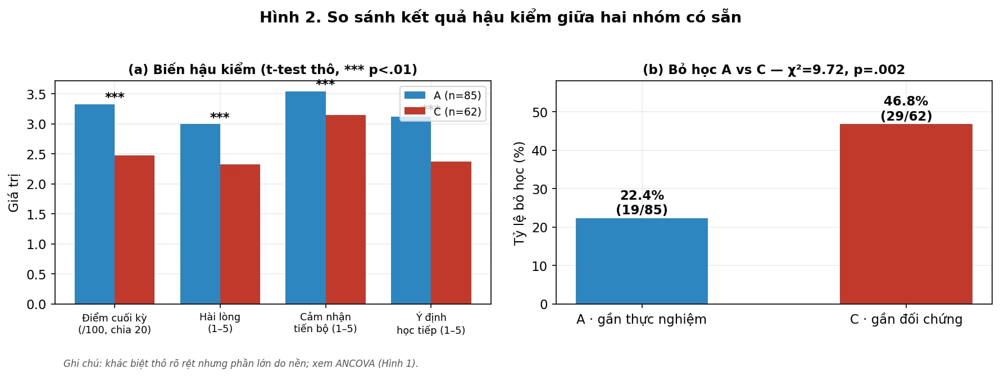
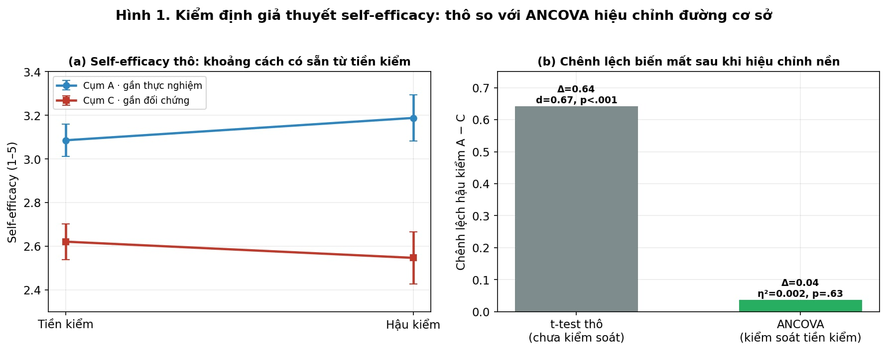

# Phần 4 & 5. KẾT QUẢ NGHIÊN CỨU VÀ PHÂN TÍCH THỰC NGHIỆM

## 5.1. Kết quả khai phá quy trình từ log khách quan

### 5.1.1. Tần suất hoạt động và chuyển tiếp hành vi
Sau khi áp dụng quy trình trừu tượng hóa, tổng cộng có **46.000 sự kiện học tập** chính được ghi nhận trên $N = 200$ học viên. Hoạt động xem video và điều hướng nội dung chiếm tỷ lệ lớn.

#### Bảng 5.1. Thống kê số lượng và tỷ lệ hoạt động của học viên từ log
| Nhãn hoạt động | Số lượng sự kiện | Tỷ lệ phần trăm |
| :--- | :---: | :---: |
| Xem video | 19.785 | $43,0\%$ |
| Điều hướng nội dung | 16.756 | $36,4\%$ |
| Hoàn thành bài học | 3.425 | $7,4\%$ |
| Làm bài kiểm tra (Quiz) | 2.938 | $6,4\%$ |
| Đóng nội dung | 2.375 Phân tích vòng lặp học tập chủ đạo cho thấy chuyển tiếp hai chiều giữa Làm trắc nghiệm và Xem video chiếm tần suất cao nhất (với lần lượt 784 và 783 lượt chuyển tiếp trực tiếp), phản ánh thói quen học tập điển hình là xem nội dung lý thuyết rồi làm câu hỏi kiểm tra và ngược lại. Bên cạnh đó, hành vi hỗ trợ và tự điều chỉnh thể hiện qua chuyển tiếp từ Xem video sang Diễn đàn đạt 263 lượt. Đáng chú ý, hành vi chuyển tiếp từ Làm quiz sang Xem đáp án ghi nhận 89 lượt, phản ánh xu hướng tìm kiếm lời giải trực tiếp của học viên khi gặp khó khăn nhận thức.

### 5.1.2. Mức độ phân tán trình tự và Hồ sơ quy trình
Phân tích biến thể vệt hoạt động (trace variants) cho thấy mức độ phân tán hành vi rất cao: trong số 200 học viên, phát hiện tới **156 biến thể trình tự khác nhau** (chiếm tỷ lệ $78,0\%$). Biến thể trình tự phổ biến nhất cũng chỉ đại diện cho $3,5\%$ mẫu học viên.

Để khái quát hóa hành vi học tập, nghiên cứu thực hiện gộp nhóm vệt hoạt động theo hai chiều đặc trưng (loại hoạt động ưu thế và tính tuyến tính điều hướng), hình thành 4 hồ sơ quy trình đại diện:

#### Bảng 5.2. Phân bố học viên theo nhóm hồ sơ quy trình
| Hồ sơ quy trình học tập | Quy mô học viên ($n$) | Tỷ lệ phần trăm |
| :--- | :---: | :---: |
| Xem nhiều video, trình tự tuyến tính | 104 | $52,0\%$ |
| Xem nhiều video, nhảy cóc nội dung | 92 | $46,0\%$ |
| Làm nhiều quiz, nhảy cóc nội dung | 3 | $1,5\%$ |
| Làm nhiều quiz, trình tự tuyến tính | 1 | $0,5\%$ |

Kết quả chỉ ra gần một nửa số học viên ($46,0\%$) có hành vi học tập phi tuyến tính (nhảy cóc nội dung), đây là cơ sở thực tế cho việc thiết kế công cụ gợi ý lộ trình thích ứng.

### 5.1.3. Phễu tiến độ theo chương và giờ học cao điểm
Phân tích phễu qua 6 chương nội dung của khóa SoDiTEC xác định điểm rơi rớt lớn nhất của học viên:

#### Bảng 5.3. Tỷ lệ học viên còn hoạt động qua các chương
| Tiến trình khóa học | Tỷ lệ còn hoạt động | Chênh lệch hao hụt |
| :--- | :---: | :---: |
| Chương 1 | $100,0\%$ | — |
| Chương 2 | $99,5\%$ | $-0,5\%$ |
| Chương 3 | $99,5\%$ | $0,0\%$ |
| Chương 4 | $98,5\%$ | $-1,0\%$ |
| Chương 5 | $97,5\%$ | $-1,0\%$ |
| **Chương 6** | **$89,5\%$** | **$-8,0\%$** |

Chương 6 ghi nhận tỷ lệ hao hụt tăng đáng kể (giảm $8,0$ điểm phần trăm), xác định đây chính là **điểm nghẽn nội dung** lớn nhất của khóa học. 
Về mặt thời gian, hoạt động học tập tập trung mạnh nhất vào các khung giờ cao điểm: **6:00 sáng, 13:00 chiều và 15:00 chiều**.

## 5.2. Kết quả phân khúc học lực và Cảnh báo sớm

### 5.2.1. Phân khúc học lực từ các đặc trưng hành vi log
Học viên được phân cụm thành 3 phân khúc học lực dựa trên 27 đặc trưng hành vi:

#### Bảng 5.4. Thống kê chi tiết theo phân khúc học lực
| Phân khúc học lực | Số học viên ($n$) | Mức hoàn thành TB | Điểm quiz TB | Mức đều đặn TB | Mức quay lui TB | Tỷ lệ nguy cơ bỏ học |
| :--- | :---: | :---: | :---: | :---: | :---: | :---: |
| **Cao** | 63 | $0,364$ | $0,448$ | $0,233$ | $0,242$ | $12,7\%$ |
| **Trung bình** | 83 | $0,296$ | $0,460$ | $0,147$ | $0,302$ | $35,0\%$ |
| **Thấp** | 54 | $0,209$ | $0,391$ | $0,075$ | $0,319$ | **$79,6\%$** |

Học viên phân khúc Thấp thể hiện các chỉ số hành vi kém hơn rõ rệt: mức độ học tập đều đặn cực thấp ($0,075$), tỷ lệ quay lui/dò dẫm nội dung cao ($0,319$), và có tới $79,6\%$ học viên thuộc diện cảnh báo bỏ học.

### 5.2.2. Phân tích tương quan hành vi log và kết quả
Hệ số tương quan Pearson ($r$) được tính toán nhằm xác định mối liên hệ tuyến tính giữa các đặc trưng hành vi từ log và kết quả đầu ra:

#### Bảng 5.5. Hệ số tương quan Pearson giữa hành vi log và kết quả
| Cặp biến số phân tích | Hệ số tương quan ($r$) | Ý nghĩa thống kê ($p$) | Diễn giải |
| :--- | :---: | :---: | :--- |
| Mức đều đặn và Mức hoàn thành | $0,459$ | $< 0,001$ | Tương quan thuận vừa. Học đều đặn dự báo tốt tiến trình. |
| Số ngày học và Mức hoàn thành | $0,459$ | $< 0,001$ | Tương quan thuận vừa. Tần suất ngày học tỷ lệ thuận với tiến độ. |
| Độ tuyến tính điều hướng và Điểm quiz | $0,328$ | $< 0,001$ | Tương quan thuận yếu. Học tuần tự giúp cải thiện kết quả quiz. |
| Tỷ lệ quay lui và Điểm quiz | $-0,301$ | $< 0,001$ | Tương quan nghịch yếu. Quay lui nhiều báo hiệu sự khó khăn nhận thức hoặc cản trở khi làm bài. |
| Chuỗi sai liên tiếp và Mức hoàn thành | $0,067$ | $> 0,05$ | Tương quan không có ý nghĩa thống kê. |
| Tỷ lệ tua lùi và Điểm quiz | $-0,110$ | $> 0,05$ | Tương quan yếu, không có ý nghĩa thống kê. |

Các tương quan yếu hoặc không có ý nghĩa ở hai dòng cuối chỉ ra giới hạn của log hành vi khi phân tích độc lập, củng cố sự cần thiết phải tích hợp khảo sát chủ quan.

## 5.3. Kết quả so sánh Tiền kiểm (Welch t-test)

Trước khóa học, kiểm định Welch t-test được thực hiện để đánh giá tính tương đương giữa hai nhóm lộ trình tự hình thành: Cụm A (Có kế hoạch) và Cụm C (Nguy cơ).

#### Bảng 5.6. Kết quả so sánh tiền kiểm A vs C (Welch t-test)
| Biến số tiền kiểm (PRE) | Cụm A ($M \pm SD$) | Cụm C ($M \pm SD$) | Giá trị $t$ | Ý nghĩa ($p$) | Hệ số Cohen's $d$ |
| :--- | :---: | :---: | :---: | :---: | :---: |
| **Self-efficacy (tiền)** | $3,09 \pm 0,67$ | $2,62 \pm 0,64$ | $4,25$ | $< 0,001$ | **$0,70$** |
| **SRL tổng hợp** | $3,69 \pm 0,51$ | $2,28 \pm 0,56$ | $15,57$ | $< 0,001$ | **$2,64$** |
| **Động lực nội tại** | $3,26 \pm 0,93$ | $2,08 \pm 0,77$ | $8,37$ | $< 0,001$ | $1,36$ |
| **Nền tảng học lực** | $2,94 \pm 0,93$ | $3,21 \pm 0,99$ | $-1,66$ | $0,099$ | $-0,28$ |
| **Định hướng làm chủ** | $3,06 \pm 0,84$ | $3,02 \pm 1,19$ | $0,24$ | $0,810$ | $0,04$ |

Kết quả so sánh chỉ ra hai nhóm có sự chênh lệch lớn ở đường cơ sở (baseline non-equivalence) ngay trước khi khóa học diễn ra. Nhóm A xuất phát cao hơn hẳn nhóm C về niềm tin năng lực bản thân ($d = 0,70$) và đặc biệt là kỹ năng tự điều chỉnh học tập SRL ($d = 2,64$). Do đó, bất kỳ sự so sánh trực tiếp nào ở hậu kiểm mà không kiểm soát các biến nền này sẽ dẫn đến kết luận sai lệch về hiệu quả can thiệp.n kiểm (Welch t-test)

Trước khóa học, kiểm định Welch t-test được thực hiện để đánh giá tính tương đương giữa hai nhóm lộ trình tự hình thành: Cụm A (Có kế hoạch) và Cụm C (Nguy cơ).

#### Bảng 5.6. Kết quả so sánh tiền kiểm A vs C (Welch t-test)
| Biến số tiền kiểm (PRE) | Cụm A ($M \pm SD$) | Cụm C ($M \pm SD$) | Giá trị $t$ | Ý nghĩa ($p$) | Hệ số Cohen's $d$ |
| :--- | :---: | :---: | :---: | :---: | :---: |
| **Self-efficacy (tiền)** | $3,09 \pm 0,67$ | $2,62 \pm 0,64$ | $4,25$ | $< 0,001$ | **$0,70$** |
| **SRL tổng hợp** | $3,69 \pm 0,51$ | $2,28 \pm 0,56$ | $15,57$ | $< 0,001$ | **$2,64$** |
| **Động lực nội tại** | $3,26 \pm 0,93$ | $2,08 \pm 0,77$ | $8,37$ | $< 0,001$ | $1,36$ |
| **Nền tảng tự đánh giá** | $2,94 \pm 0,93$ | $3,21 \pm 0,99$ | $-1,66$ | $0,099$ | $-0,28$ |
| **Định hướng làm chủ** | $3,06 \pm 0,84$ | $3,02 \pm 1,19$ | $0,24$ | $0,810$ | $0,04$ |

*   **Nhận xét:** Hai nhóm có sự chênh lệch lớn ở đường cơ sở (baseline non-equivalence) ngay trước khi khóa học diễn ra. Nhóm A xuất phát cao hơn hẳn nhóm C về niềm tin năng lực bản thân ($d = 0,70$) và đặc biệt là kỹ năng tự điều chỉnh học tập SRL ($d = 2,64$). Do đó, bất kỳ sự so sánh trực tiếp nào ở hậu kiểm mà không kiểm soát các biến nền này sẽ dẫn đến kết luận sai lệch về hiệu quả can thiệp.

## 5.4. Kết quả so sánh thô Hậu kiểm (Welch t-test & Chi-square)

Sau khi kết thúc khóa học, so sánh thô không hiệu chỉnh được tiến hành giữa cụm A và cụm C.

#### Bảng 5.7. Kết quả so sánh thô hậu kiểm A vs C
| Biến số hậu kiểm (POST) | Cụm A ($M$) | Cụm C ($M$) | Thống kê kiểm định | Ý nghĩa ($p$) | Cohen's $d$ |
| :--- | :---: | :---: | :---: | :---: | :---: |
| **Điểm cuối kỳ / 100** | $66,51$ | $49,45$ | $t = 7,17$ | $< 0,001$ | $1,20$ |
| **Ý định học tiếp** | $3,12$ | $2,37$ | $t = 5,48$ | $< 0,001$ | $0,92$ |
| **Mức độ hài lòng** | $2,99$ | $2,33$ | $t = 4,91$ | $< 0,001$ | $0,82$ |
| **Self-efficacy (hậu)** | $3,19$ | $2,55$ | $t = 4,02$ | $< 0,001$ | $0,67$ |
| **Cảm nhận tiến bộ** | $3,54$ | $3,15$ | $t = 3,17$ | $0,002$ | $0,54$ |
| **Tỷ lệ bỏ học** | $22,4\%$ | $46,8\%$ | $\chi^2 = 9,72$ | **$0,002$** | — |

Ở mức so sánh thô, nhóm A vượt trội nhóm C có ý nghĩa thống kê trên mọi khía cạnh, đặc biệt là điểm số ($d = 1,20$) và tỷ lệ bỏ học giảm một nửa.

> **Hình 5.1.** So sánh kết quả hậu kiểm và tỷ lệ bỏ học giữa hai nhóm có sẵn (Cụm A vs Cụm C).
> 
> 

## 5.5. Kiểm định giả thuyết (Change-score và ANCOVA)

Để kiểm chứng xem sự vượt trội của cụm A có thực sự do can thiệp lộ trình cá nhân hóa hay chỉ là sự kéo dài của lệch nền cơ sở, nghiên cứu thực hiện hai phương pháp kiểm soát:

### 1. Phân tích điểm chênh lệch (Change-score: hậu - tiền)
Đo lường mức độ biến thiên niềm tin năng lực bản thân (self-efficacy) trong nội bộ từng học viên cho thấy: điểm số của Cụm A tăng trung bình $+0,10$ (biến thiên tiệm cận mức ý nghĩa thống kê với $t = 1,98, p = 0,051$), trong khi điểm số của Cụm C giảm trung bình $-0,07$ (không có ý nghĩa thống kê, $p = 0,205$). So sánh chênh lệch giữa hai cụm chỉ ra sự khác biệt có ý nghĩa thống kê ($t = 2,27, p = 0,025, d = 0,38$). Hướng biến thiên trái ngược này (A tăng, C giảm) gợi ý sơ bộ rằng can thiệp có thể mang lại hiệu quả tích cực đối với niềm tin năng lực bản thân của người học.

### 2. Phân tích đồng biến ANCOVA kiểm soát đường cơ sở
Để kiểm tra tính vững chắc của kết quả trên khi kiểm soát các chênh lệch đầu vào, nghiên cứu thực hiện hai mô hình ANCOVA:
*   **Mô hình ANCOVA thứ nhất (biến phụ thuộc: self-efficacy hậu kiểm; đồng biến: self-efficacy tiền kiểm):** Sau khi kiểm soát điểm số tiền kiểm, hiệu ứng của tư cách nhóm (A/C) lên self-efficacy hậu kiểm không còn ý nghĩa thống kê ($F(1, 144) = 0,24, p = 0,627$, hệ số partial $\eta^2 = 0,002$ - chỉ giải thích thêm $0,2\%$ phương sai). Điểm trung bình hiệu chỉnh sau ANCOVA của hai nhóm không ghi nhận sự khác biệt đáng kể ($A_{adj} = 2,93$ so với $C_{adj} = 2,90$). Các giả định về độ dốc hồi quy đồng nhất ($p = 0,654$) và phương sai đồng nhất ($p = 0,962$) của mô hình đều được thỏa mãn.
*   **Mô hình ANCOVA thứ hai (biến phụ thuộc: điểm số cuối kỳ; đồng biến: self-efficacy tiền kiểm, SRL, và học lực tự đánh giá):** Hiệu ứng của tư cách cụm lên điểm số cuối kỳ cũng không có ý nghĩa thống kê ($F(1, 142) = 1,59, p = 0,209$, partial $\eta^2 = 0,011$, giải thích được $1,1\%$ phương sai). Như vậy, khoảng cách chênh lệch thô 17 điểm số cuối kỳ ban đầu phần lớn đã được giải thích bởi các biến đồng biến ở đường cơ sở.

#### Bảng 5.8. So sánh kích thước hiệu ứng thô so với hiệu ứng ANCOVA
| Chỉ số kết quả | Cohen's $d$ (so sánh thô) | partial $\eta^2$ (ANCOVA hiệu chỉnh) | Ý nghĩa nhóm sau hiệu chỉnh |
| :--- | :---: | :---: | :--- |
| Self-efficacy hậu | $0,67$ | $0,002$ | Biến mất ($p = 0,627$) |
| Điểm số cuối kỳ | $1,20$ | $0,011$ | Không có ý nghĩa ($p = 0,209$) |
| Change-score ($\Delta$) | $0,38$ | — | Có ý nghĩa ($p = 0,025$) |

Sự mâu thuẫn giữa kết quả change-score (chỉ ra có hiệu ứng nhóm) và ANCOVA (chỉ ra không có hiệu ứng nhóm) trên cùng một tập dữ liệu quan sát chính là biểu hiện điển hình của **Nghịch lý Lord**. Kết luận khoa học cuối cùng cần được xem xét hết sức thận trọng ở phần Bàn luận tiếp theo.

> **Hình 5.2.** Kiểm định giả thuyết self-efficacy: chênh lệch thô (trái) biến mất sau khi ANCOVA hiệu chỉnh đường cơ sở (phải).
> 
> 

